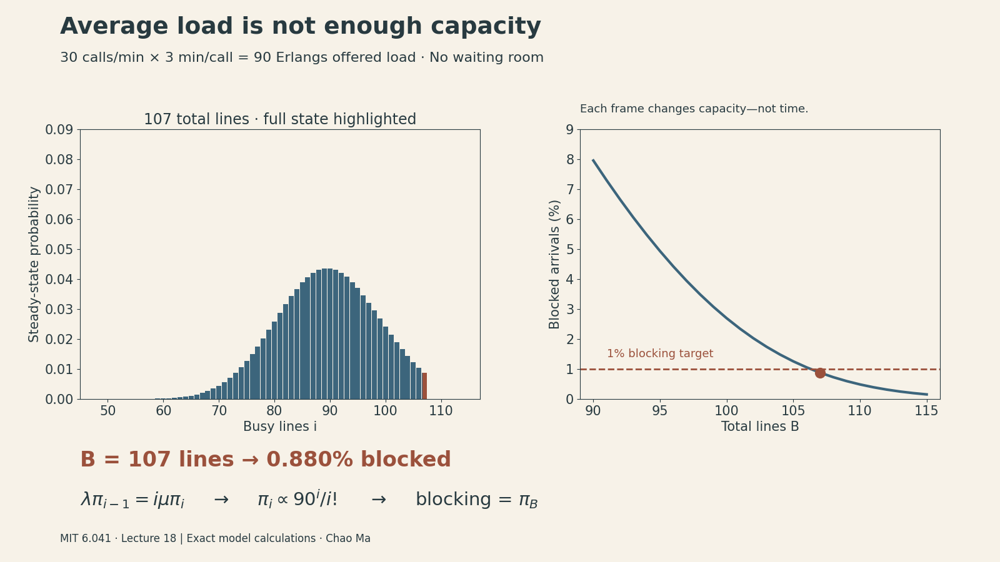
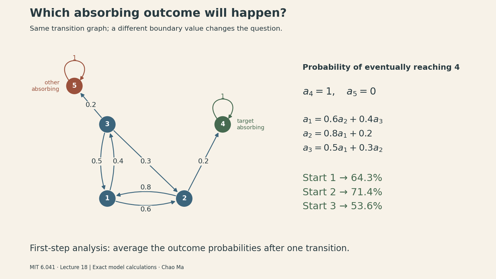

Notes on **MIT 6.041 Probabilistic Systems Analysis and Applied Probability, Lecture 18: Markov Chains III**, taught by John Tsitsiklis.

A telephone exchange receives 30 calls per minute. Each call lasts three minutes on average. That is an offered load of 90 calls—but **90 lines still reject about 8% of incoming calls**. Why isn't matching average demand enough?

This lecture makes Markov chains answer three operational questions: how much capacity to provide, which terminal outcome a process will reach, and how long it takes to get there. The common technique is to turn the transition graph into equations, with boundary conditions chosen for the question.

<figure>

<button type="button" id="capacity-toggle" aria-controls="capacity-animation">Play capacity comparison</button>
<figcaption>Each frame changes the number of lines, holding arrival and service rates fixed. These are exact stationary calculations, not simulated call histories. <a href="markov-iii-assets/capacity.png">Static figure</a> · <a href="markov-iii-assets/capacity-data.csv">Underlying data</a>.</figcaption>
</figure>
<script>
(() => {
 const img=document.getElementById('capacity-animation');
 const button=document.getElementById('capacity-toggle');
 let playing=!window.matchMedia('(prefers-reduced-motion: reduce)').matches;
 function update(){img.src='markov-iii-assets/capacity.'+(playing?'gif':'png');button.textContent=playing?'Stop animation':'Play capacity comparison';}
 button.addEventListener('click',()=>{playing=!playing;update();});update();
})();
</script>

<iframe style="width:100%;aspect-ratio:16/9;border:0" src="https://www.youtube.com/embed/HIMxdWDLEK8" title="MIT 6.041 Lecture 18: Markov Chains III — John Tsitsiklis" loading="lazy" allow="accelerometer; clipboard-write; encrypted-media; gyroscope; picture-in-picture; web-share" allowfullscreen></iframe>

## Steady state does not make neighboring observations independent

[Lecture 17](markov-chains-ii.qmd) introduced convergence and balance equations. For the two-state example,

$$
P=\begin{pmatrix}0.5&0.5\\0.2&0.8\end{pmatrix},\qquad
\pi=(2/7,5/7).
$$

Let $r_{ij}(n)=P(X_n=j\mid X_0=i)$. Under the finite-chain convergence conditions discussed previously—one recurrent class, which is aperiodic—$r_{ij}(n)$ approaches $\pi_j$.

The lecture asks about joint events at different times. Condition on the earlier state and use the Markov property:

$$
P(X_1=1,X_{100}=1\mid X_0=1)
=p_{11}r_{11}(99)\approx\frac12\frac27=\frac17.
$$

But for adjacent times,

$$
P(X_{100}=1,X_{101}=2\mid X_0=1)
=r_{11}(100)p_{12}\approx\frac27\frac12=\frac17,
$$

not $\pi_1\pi_2=10/49$. Being late in the process makes the marginal distribution approximately stationary; it does not erase the dependence created by the next transition.

**Worked extension:** for this particular matrix, $r_{11}(n)=2/7+(5/7)(0.3)^n$. The error is tiny after 100 steps. That number of steps is not a general rule: if the cross-state probabilities were 0.001 and 0.002, the corresponding decay factor would be $0.997^n$, still about 0.74 after 100 steps. Mixing depends on the transition probabilities.

For a contrasting pair of well-separated late times,

$$
P(X_{100}=1,X_{200}=1\mid X_0=1)
=r_{11}(100)r_{11}(100)\approx\pi_1^2=4/49.
$$

Here both the time to the first observation and the gap between observations are long relative to this chain’s mixing time. That is why approximate independence is justified in this example, while it fails for adjacent observations.

## Capacity planning: a loss system has no queue

Suppose calls arrive according to a Poisson process with rate $\lambda$, and independent call durations are exponential with rate $\mu$. There are $B$ lines. An arrival takes a free line immediately or is rejected if all lines are busy.

The state $i\in\{0,\ldots,B\}$ is the number of busy lines. This is a **loss system**, unlike the waiting queue from Lecture 17. Its parameters here are

$$
\lambda=30\text{ calls/min},\qquad
1/\mu=3\text{ min/call},\qquad
 a=\lambda/\mu=90.
$$

The offered load $a$ is dimensionless, conventionally measured in Erlangs. It is the mean occupancy an unlimited-capacity version would have. It is not the actual mean occupancy after some calls are rejected.

### Why departures occur at rate iμ

With $i$ independent exponential calls in progress, the next completion is the minimum of $i$ exponential clocks, so its rate is $i\mu$. During a small interval $\delta$,

$$
P(i\to i+1)=\lambda\delta+o(\delta),\qquad
P(i\to i-1)=i\mu\delta+o(\delta).
$$

These formulas apply where the neighboring state exists. At $B$, rejected arrivals do not increase the state; at zero, no departure is possible. Multiple events contribute higher-order terms. The lecture discretizes time into small intervals of length $\delta$ and uses a discrete-time birth–death approximation, rather than developing continuous-time Markov-chain theory. The common factor $\delta$ cancels from the stationary flow-balance equations below.

Across the cut between states $i-1$ and $i$, stationary flow must balance:

$$
\lambda\pi_{i-1}=i\mu\pi_i.
$$

Repeated substitution gives

$$
\pi_i=\pi_0\frac{a^i}{i!},\qquad
\pi_0=\left(\sum_{k=0}^B\frac{a^k}{k!}\right)^{-1}.
$$

The distribution resembles a Poisson mass function, truncated at capacity and renormalized. Under the Poisson arrival assumption, arrivals see the stationary occupancy proportions. Thus the fraction of incoming calls rejected is the probability that all lines are busy:

$$
E(B,a)=\pi_B=\frac{a^B/B!}{\sum_{k=0}^B a^k/k!}.
$$

### Average demand is not a service-level target

For $a=90$, direct calculation gives:

| Lines B | Blocked incoming calls |
|---:|---:|
| 90 | 7.957% |
| 100 | 2.696% |
| 106 | 1.055% |
| 107 | 0.880% |
| 110 | 0.486% |

The lecture describes roughly 106 lines for about 1% blocking. **If the requirement is strictly below 1%, the smallest integer is 107.** This is a numerical refinement of the lecture's approximate example, not a different model.

A stable recursion avoids the large powers and factorials in direct evaluation:

```python
def erlang_b(lines, offered_load):
    blocking = 1.0  # zero lines: every arrival is rejected
    for b in range(1, lines + 1):
        blocking = offered_load * blocking / (b + offered_load * blocking)
    return blocking

assert erlang_b(106, 90) > 0.01 > erlang_b(107, 90)
```

The mechanism is variability: occupancy sometimes exceeds its average. Extra lines absorb those fluctuations. **Worked extension:** the mean busy-line count is $a[1-E(B,a)]$, because accepted arrival rate equals average departure rate. At 90 lines it is about 82.84, even though the offered load is 90.

This model can illustrate admission-controlled servers, but a real system with queues, bursty arrivals, retries, or different service-time structure needs its assumptions checked. This lecture does not establish a universal capacity rule for computing systems.

::: {.callout-note title="A related deployment constraint"}
Capacity is only one constraint on a deployed model. The first card in [DailyChat's “The constraints beyond the model”](https://dailychat.net/2026-09-14.html?utm_source=ickma_blog&utm_medium=referral&utm_campaign=mit_probability_18&utm_content=capacity_example){#dailychat-capacity} discusses onboard versus cloud inference, latency, and network variability. It is a separate qualitative systems discussion, not an application of this telephone-loss calculation to robots.
:::

## Absorption probabilities: which outcome will happen?

Now change the question. Instead of long-run occupancy, ask which absorbing state a process reaches. The lecture's graph has transient states 1, 2, 3 and absorbing states 4, 5:

- From 1: go to 2 with probability 0.6 or 3 with probability 0.4.
- From 2: return to 1 with probability 0.8 or reach 4 with probability 0.2.
- From 3: go to 1, 2, or 5 with probabilities 0.5, 0.3, and 0.2.
- States 4 and 5 retain the process forever.



Let $a_i$ be the probability of eventually reaching 4, starting from $i$. The boundary conditions are $a_4=1$ and $a_5=0$. For the remaining states, condition on the first transition:

$$
\begin{aligned}
a_1&=0.6a_2+0.4a_3,\\
a_2&=0.8a_1+0.2,\\
a_3&=0.5a_1+0.3a_2.
\end{aligned}
$$

Solving these lecture equations gives

$$
a_1=\frac9{14},\qquad a_2=\frac57,\qquad a_3=\frac{15}{28}.
$$

A first-step equation compresses infinitely many possible paths, including repeated returns, into a finite linear system. For example, reaching state 2 does not guarantee reaching 4: the chain may return to 1 and later exit through 5.

**Compact extension:** with $Q$ the transient-to-transient transition matrix and $r=(0,0.2,0)^\top$ the direct probabilities of entering 4,

$$
Q=\begin{pmatrix}0&0.6&0.4\\0.8&0&0\\0.5&0.3&0\end{pmatrix},\qquad
(I-Q)a=r.
$$

The lecture also uses a useful simplification: when the question only asks which terminal class is reached, collapse each closed recurrent class into a single absorbing state, adding transition probabilities that lead into that class. This preserves the entry outcome; it is not a general license to merge arbitrary states.

In the five-state example above, eventual absorption occurs with probability one, and $I-Q$ is invertible. Do not apply this conclusion blindly if an omitted recurrent class can retain the process indefinitely.

## Expected time: the extra “1” is the step you just took

For the expected time to reach a target set $A$, define

$$
T_A=\inf\{n\ge0:X_n\in A\},\qquad t_i=E[T_A\mid X_0=i].
$$

Then

$$
t_i=0\quad(i\in A),\qquad
t_i=1+\sum_jp_{ij}t_j\quad(i\notin A).
$$

Compare this with the absorption-probability equation $a_i=\sum_jp_{ij}a_j$. The averaging mechanism is the same, but elapsed time accumulates a cost of one per transition. Boundary values encode whether we ask about a probability or a waiting time.

**Supplementary conditions beyond the lecture’s treatment:** for a finite-state chain, these equations have a unique finite solution on the non-target states when the target is reached almost surely from every state under consideration. If a start state has positive probability of never reaching the target, its unconditional expected hitting time is infinite. Almost-sure hitting alone does not guarantee a finite mean in an infinite-state chain.

The lecture's next slide changes the graph: state 5 is removed, and state 3 now goes to 1 or 2 with probability 0.5 each. State 4 is the only absorbing outcome. For this revised graph,

$$
\begin{aligned}
t_1&=1+0.6t_2+0.4t_3,\\
t_2&=1+0.8t_1,\\
t_3&=1+0.5t_1+0.5t_2,\qquad t_4=0.
\end{aligned}
$$

**Calculated solution of the slide's example:** $(t_1,t_2,t_3)=(13.75,12,13.875)$ expected steps. Notice that the graph changed: these are not waiting times for the earlier two-outcome system.

As a separate extension, time to either absorbing outcome in the original graph satisfies $(I-Q)t=\mathbf1$, giving about 9.46 steps from state 1. Applying the lecture’s general merging technique to this example, we merge states 4 and 5 into one “already absorbed” state; probabilities of entering either are added. The resulting first-step waiting-time equations give the same answer. This is different from the conditional time to reach 4 given that 4 is reached.

## First arrival versus first return

If you start at the target, the first hitting time defined above is zero. A **first return** instead uses

$$
T_s^+=\inf\{n\ge1:X_n=s\}.
$$

To calculate a first hitting time, we may replace the target’s outgoing edges with a probability-one self-loop. Transitions after the first arrival cannot change when that arrival occurred. For a first return, however, retain the original first transition from the target and then use those hitting-time values. A return requires at least one transition, even if that transition is a self-loop. First-step analysis gives

$$
t_s^+=1+\sum_jp_{sj}t_j.
$$


For the two-state chain at the beginning, $t_1=0$ and $t_2=1+0.8t_2$, so $t_2=5$. Starting from 1, the first step either returns immediately with probability 0.5 or moves to 2 with probability 0.5:

$$
t_1^+=1+0.5(0)+0.5(5)=3.5.
$$

**Standard result beyond this lecture, used as a consistency check:** the finite irreducible chain's mean return time is $1/\pi_1=7/2$. A state occupied more often in the long run has a shorter mean recurrence interval. Do not confuse this recurrence statement with independence of consecutive states.

## Choosing the right equations

Before calculating, identify the question:

- **Occupancy:** solve stationary flow balance and normalize probabilities.
- **Eventual destination:** set success/failure boundary values and average after one step.
- **Time to a target:** set zero time at the target and add one step before averaging.
- **Time to return:** require a first transition before applying hitting-time values.

In the phone example, the useful answer was not simply “average load equals 90.” It was a distribution over occupancy states, a blocking probability, and a capacity tied to an explicit service target. That is what a well-chosen state and the right boundary conditions make possible.

## Sources and reproducibility

- [MIT OCW lecture page and video](https://ocw.mit.edu/courses/6-041-probabilistic-systems-analysis-and-applied-probability-fall-2010/resources/lecture-18-markov-chains-iii/), John Tsitsiklis, Fall 2010.
- [Official Lecture 18 slides](https://ocw.mit.edu/courses/6-041-probabilistic-systems-analysis-and-applied-probability-fall-2010/5e411812d2aa2b34818a6df5ff0338b3_MIT6_041F10_L18.pdf).
- [Figure code](markov-iii-assets/create_figures.py), [capacity data](markov-iii-assets/capacity-data.csv), [validation results](markov-iii-assets/validation.json), and [head animation as MP4](markov-iii-assets/capacity.mp4). Images are programmatically drawn, with exact model values rather than measured traffic data.
- Figure workflow used the scientific-visualization skill; see Kassis et al., [Scientific Agent Skills: A Library of Procedural Knowledge for Research Agents](https://doi.org/10.48550/arXiv.2609.00065) (2026).

<script>
(() => {
 const link=document.getElementById('dailychat-capacity');
 if(!link)return;
 link.addEventListener('click',()=>{
  if(location.hostname==='ickma2311.github.io' && typeof window.gtag==='function'){
   window.gtag('event','dailychat_outbound_click',{article:'markov-chains-iii',link_url:link.href,link_position:'capacity_example',transport_type:'beacon'});
  }
 });
})();
</script>
