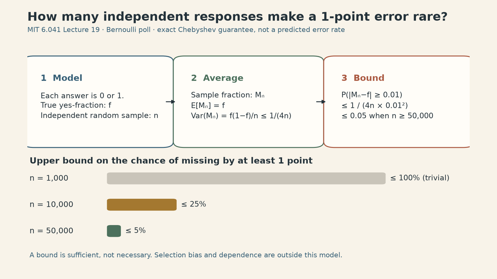

Notes on [**MIT 6.041SC Probabilistic Systems Analysis and Applied Probability, Lecture 19: Weak Law of Large Numbers**](https://ocw.mit.edu/courses/6-041sc-probabilistic-systems-analysis-and-applied-probability-fall-2013/pages/unit-iv/lecture-19/), taught by John Tsitsiklis.

Suppose a pollster reports a sample fraction and promises to be within one percentage point of the population fraction with at least 95% probability. How many people must be sampled? Before choosing a number, we need to say what is random, what is fixed, and which sampling assumptions make such a promise meaningful. This first lecture in the course's limit-theorems unit comes after the Markov-chain lectures.

<iframe style="width:100%;aspect-ratio:16/9;border:0" src="https://www.youtube-nocookie.com/embed/3eiio3Tw7UQ" title="MIT 6.041 Lecture 19: Weak Law of Large Numbers — John Tsitsiklis" loading="lazy" allow="accelerometer; clipboard-write; encrypted-media; gyroscope; picture-in-picture; web-share" allowfullscreen></iframe>

## The sample mean is random; the population mean is not

Let $X_1,\ldots,X_n$ be independent, identically distributed (i.i.d.) measurements with finite mean $\mu$ and variance $\sigma^2$. The average from one sample is

$$
M_n=\frac{1}{n}\sum_{i=1}^n X_i.
$$

The population mean $\mu$ is a fixed number under this model. $M_n$ is a random variable: another independently drawn sample can produce another average. Linearity of expectation and independence give two distinct facts:

$$
\mathbb E[M_n]=\mu,
\qquad
\operatorname{Var}(M_n)
=\frac{1}{n^2}\sum_{i=1}^n\operatorname{Var}(X_i)
=\frac{\sigma^2}{n}.
$$

Unbiasedness alone says where the average of many hypothetical *sample means* would land. It does not promise that one sample mean is close. The $1/n$ variance gives a route from that average statement to a probability bound for a single sample.

## Chebyshev turns variance into a guarantee

For any random variable $X$ with finite variance and any $\varepsilon>0$, Chebyshev's inequality says

$$
\Pr\bigl(|X-\mathbb E[X]|\ge\varepsilon\bigr)
\le\frac{\operatorname{Var}(X)}{\varepsilon^2}.
$$

It follows by applying Markov's inequality to the nonnegative variable $(X-\mathbb E[X])^2$. This is a distribution-free bound: knowing the mean and variance is enough; knowing the full probability density is unnecessary. It may be loose. Applying it to $M_n$ yields

$$
\boxed{\Pr\bigl(|M_n-\mu|\ge\varepsilon\bigr)
\le\frac{\sigma^2}{n\varepsilon^2}.}
$$

Fix any positive error tolerance $\varepsilon$. As $n$ grows, the right-hand side goes to zero. That proves the lecture's version of the **weak law of large numbers**:

$$
M_n\xrightarrow{\Pr}\mu,
\quad\text{meaning}\quad
\forall\varepsilon>0,\ 
\Pr(|M_n-\mu|\ge\varepsilon)\longrightarrow 0.
$$

“In probability” is doing real work here. It says the chance of landing outside *any fixed* band around $\mu$ vanishes. It does not say every realized sequence of samples eventually stays inside the band. Nor does it supply a universal finite-sample accuracy without a variance and a sampling model.

## A poll: 50,000 is a sufficient bound, not a forecast

Let $X_i=1$ for “yes” and $0$ for “no,” and let $f$ be the true population yes-fraction. Under the lecture's independent random-sampling model, $\mathbb E[X_i]=f$ and $\operatorname{Var}(X_i)=f(1-f)\le 1/4$. The sample mean $M_n$ is the observed yes-fraction. For an error of at least one percentage point,

$$
\Pr(|M_n-f|\ge 0.01)
\le\frac{f(1-f)}{n(0.01)^2}
\le\frac{1}{4n(0.01)^2}.
$$

To make this **upper bound** at most $0.05$, it suffices to choose

$$
n\ge\frac{1}{4(0.05)(0.01)^2}=50{,}000.
$$

The figure shows a *worst-case guarantee*, not the actual error distribution. At $n=1{,}000$, the raw Chebyshev expression is $2.5$, so after the universal probability cap of $1$ it says nothing useful. At $n=50{,}000$, it certifies at most a 5% chance of missing by at least one point. The lecture calls this conservative and previews a sharper normal approximation in Lecture 20. We should not read “50,000” as the sample size every real poll needs.

More importantly, random-sampling assumptions are not cosmetic. A large convenience sample, systematic nonresponse, or dependent observations can miss the population fraction even when the arithmetic above is correct for the *i.i.d. model*. More samples reduce the model's random variance; they do not automatically remove selection bias.

### Why dependence changes the $1/n$ story

As a constructed extension, suppose every measurement contains the same random disturbance $Z$ plus its own independent noise $E_i$: $X_i=\mu+Z+E_i$, with $\mathbb E[Z]=\mathbb E[E_i]=0$, $\operatorname{Var}(Z)=\tau^2$, and $\operatorname{Var}(E_i)=v$. Then

$$
M_n=\mu+Z+\frac1n\sum_{i=1}^n E_i,
\qquad
\operatorname{Var}(M_n)=\tau^2+\frac vn.
$$

The independent noise fades; the shared disturbance does not. This is why simply replacing $n$ in the lecture's formula without checking dependence can create false precision.

## A small tail probability can still carry a large expectation

The lecture gives a useful warning about the meaning of convergence in probability. Define $Y_n=0$ with probability $1-1/n$ and $Y_n=n$ with probability $1/n$. For every fixed $\varepsilon>0$, once $n\ge\varepsilon$,

$$
\Pr(|Y_n|\ge\varepsilon)=\frac1n\longrightarrow0.
$$

So $Y_n$ converges in probability to zero. Yet

$$
\mathbb E[Y_n]=n\cdot\frac1n=1,
\qquad
\mathbb E[Y_n^2]=n^2\cdot\frac1n=n.
$$

![Exact two-point example: as n increases from 10 to 1,000, the chance of the rare value n falls from 10% to 0.1%, while its contribution keeps E[Y_n] equal to one.](lecture19-assets/rare-tail.png)

The increasingly unlikely event also becomes increasingly large. Convergence in probability controls the chance of being away from a target; by itself it does **not** control the size of the rare values or make expectations converge. This distinction matters when an “average case” hides a costly tail.

## What the next limit theorem asks

The weak law answers whether $M_n$ concentrates near $\mu$. It does not describe the detailed shape of its residual fluctuations. Lecture 19 closes by comparing $S_n=\sum_iX_i$, whose variance is $n\sigma^2$, with $M_n=S_n/n$, whose variance is $\sigma^2/n$. To keep a nondegenerate scale, it introduces

$$
Z_n=\frac{S_n-n\mu}{\sigma\sqrt n}
\quad(\sigma>0).
$$

The central limit theorem concerns the distribution of $Z_n$, not a claim that every finite-sample sum is exactly normal. That is the bridge to Lecture 20. For this lecture, the practical distinction is simpler: a sample average becomes reliable only relative to an error tolerance, a probability target, and assumptions one can defend.

## Sources

- [MIT OpenCourseWare, Lecture 19: Weak Law of Large Numbers](https://ocw.mit.edu/courses/6-041sc-probabilistic-systems-analysis-and-applied-probability-fall-2013/pages/unit-iv/lecture-19/) (Fall 2013, John Tsitsiklis).
- [Official Lecture 19 slides](https://ocw.mit.edu/courses/6-041sc-probabilistic-systems-analysis-and-applied-probability-fall-2013/d569abb143b22f469a09ff218cb3383c_MIT6_041SCF13_L19.pdf).
- [Official Lecture 19 transcript](https://ocw.mit.edu/courses/6-041sc-probabilistic-systems-analysis-and-applied-probability-fall-2013/fb65835aecf94dfc08308a5c2dcfc047_MIT6_041SCF13_lec19_300k.pdf).
