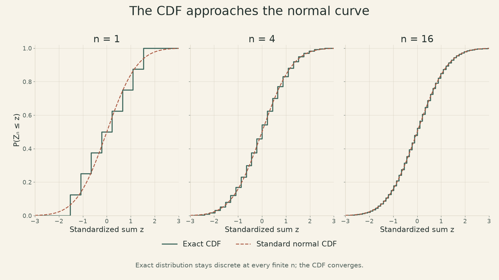
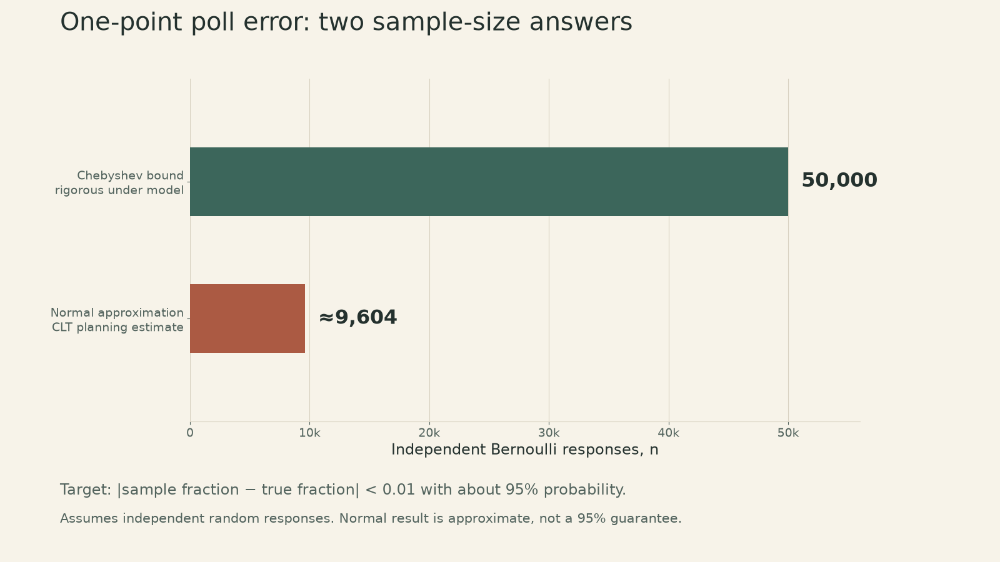
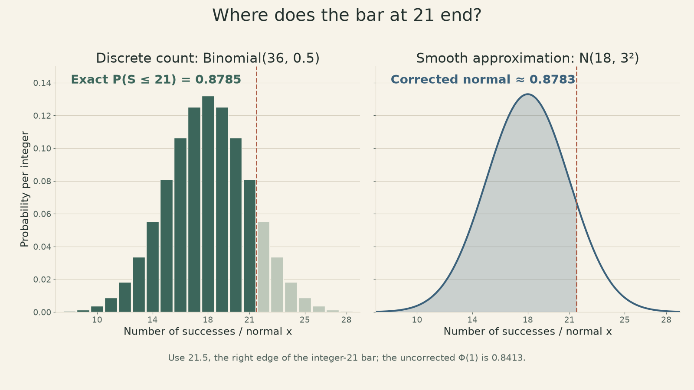

Notes on [**MIT 6.041SC, Lecture 20: Central Limit Theorem**](https://ocw.mit.edu/courses/6-041sc-probabilistic-systems-analysis-and-applied-probability-fall-2013/pages/unit-iv/lecture-20/), taught by John Tsitsiklis.

The [weak law of large numbers](https://ickma2311.github.io/Math/Probability/mit-6041-lecture19-weak-law.html) says a sample average gets close to its population mean. The central limit theorem (CLT) asks a more detailed question: **how likely is a particular error at a finite sample size?** Its answer is a normal approximation—but only after centering and scaling the sum, and only under the theorem's assumptions.

<iframe style="width:100%;aspect-ratio:16/9;border:0" src="https://www.youtube-nocookie.com/embed/Tx7zzD4aeiA" title="MIT 6.041 Lecture 20: Central Limit Theorem — John Tsitsiklis" loading="lazy" allow="accelerometer; clipboard-write; encrypted-media; gyroscope; picture-in-picture; web-share" allowfullscreen></iframe>

## What converges to a normal distribution?

Let $X_1,X_2,\ldots$ be independent and identically distributed (i.i.d.) from **one fixed distribution** with finite mean $\mu$ and finite, positive variance $\sigma^2$. Write $S_n=\sum_{i=1}^n X_i$. The raw sum has mean $n\mu$ and standard deviation $\sigma\sqrt n$; both change with $n$. We therefore study the centered and scaled sum

$$
Z_n=\frac{S_n-n\mu}{\sigma\sqrt n}
   =\frac{\sqrt n\,(M_n-\mu)}{\sigma},
\qquad M_n=\frac{S_n}{n}.
$$

For every real number $z$, the CLT says

$$
\Pr(Z_n\leq z)\longrightarrow\Phi(z),
$$

where $\Phi$ is the standard normal cumulative distribution function (CDF). **It is the standardized sum's CDF that converges.** The theorem does not say the unscaled $S_n$ settles into a fixed normal distribution, nor that a discrete sum suddenly has a continuous probability density.

{fig-alt="Exact step CDFs of standardized sums of uniform integer draws converge toward a dashed standard-normal CDF as n increases from 1 to 16."}

The figure uses exact convolution for independent fair draws from $\{1,\ldots,8\}$, not a simulation. As $n$ grows, the steps become smaller and the CDF follows the normal curve more closely. A strongly skewed starting distribution can converge less quickly at the same $n$. The theorem gives a limiting result; it does not supply a universal sample size at which every normal approximation becomes accurate.

## Revisiting the one-point poll

Suppose each independent, randomly sampled response is $X_i\sim\mathrm{Bernoulli}(f)$, where the unknown population fraction is $f$. The observed fraction $M_n$ has mean $f$ and variance $f(1-f)/n$. Because $f(1-f)\leq 1/4$, the standard deviation of $M_n$ is at most $1/(2\sqrt n)$.

We want the probability of an error of **at least one percentage point** to be no more than 5%. The earlier Chebyshev bound gives a sufficient, model-based guarantee:

$$
\Pr(|M_n-f|\geq 0.01)
\leq\frac{f(1-f)}{n(0.01)^2}
\leq\frac{2500}{n}.
$$

So $n=50{,}000$ makes that upper bound 0.05. The CLT instead estimates the two-sided tail by replacing the standardized fraction with a normal variable. Using the worst-case standard deviation $1/2$, a 95% central normal interval has half-width approximately $1.96/(2\sqrt n)$. Setting that to 0.01 gives

$$
n\approx\left(\frac{1.96}{2(0.01)}\right)^2\approx 9{,}604.
$$

At $n=10{,}000$, the same approximation gives $2[1-\Phi(2)]\approx0.0455$ for the two-sided error probability. The contrast is useful: **50,000 is sufficient by a conservative inequality; about 9,604 is a normal-approximation planning number.** The latter is not a rigorous 95% guarantee for every $f$ and finite $n$.

{fig-alt="Chebyshev gives a sufficient 50,000 responses; a CLT normal approximation gives about 9,604 for the same polling target. The chart explicitly labels the guarantee versus approximation."}

Both calculations depend on the sampling model. More responses reduce random sampling error; they do not remove selection bias or a shared disturbance among responses.

## Why the cutoff moves by half a count

The lecture's finite example is $S\sim\mathrm{Binomial}(36,0.5)$, with mean 18 and standard deviation 3. Its exact cumulative probability through 21 is **0.8785**:

$$
\begin{aligned}
\Pr(S\leq21)&=\sum_{k=0}^{21}\binom{36}{k}2^{-36}\\
&\approx0.8785.
\end{aligned}
$$

A direct normal calculation at 21 uses $\Phi((21-18)/3)=\Phi(1)\approx0.8413$ and misses the area represented by the integer-21 bar. To approximate a discrete event with a continuous curve, include the whole bar by moving its right edge to 21.5. That edge standardizes to $(21.5-18)/3=7/6$, so

$$
\begin{aligned}
\Pr(S\leq21)&\approx\Phi(7/6)\\
&\approx0.8783.
\end{aligned}
$$

{fig-alt="A dashed line at 21.5 marks the right edge of the integer-21 binomial bar. Exact cumulative probability through 21 is 0.8785; corrected normal area is 0.8783."}

This **continuity correction** is a finite-sample approximation for integer counts. It does not change the CLT's CDF statement. Its small error in this symmetric example should not be taken as a general accuracy promise for every binomial distribution.

## Normal and Poisson are different binomial limits

For $S_n\sim\mathrm{Binomial}(n,p)$ with a **fixed** $0<p<1$, both its mean $np$ and variance $np(1-p)$ grow. Centering by $np$ and dividing by $\sqrt{np(1-p)}$ leads to the CLT's standard normal limit. This is the regime behind the polling calculation.

Another regime lets $p=p_n$ shrink as $n$ grows while $np_n\to\lambda$ remains finite. Then the *count itself* approaches a $\mathrm{Poisson}(\lambda)$ distribution. The Bernoulli law changes with $n$ here, so this is not a direct application of the fixed-law i.i.d. CLT. The approximation to choose depends on which quantities stay fixed: many moderately probable successes favor a normal description near the mean; rare events with a finite expected count favor Poisson.

The CLT is most valuable when its assumptions and scale are made visible. It can turn a bound into a sharper planning estimate, but a normal-looking curve never repairs a poor sampling design.

**Source:** [MIT OCW Lecture 20 page](https://ocw.mit.edu/courses/6-041sc-probabilistic-systems-analysis-and-applied-probability-fall-2013/pages/unit-iv/lecture-20/) · [lecture slides](https://ocw.mit.edu/courses/6-041sc-probabilistic-systems-analysis-and-applied-probability-fall-2013/e2d51b7d3f67afbc118dbb3478276ec5_MIT6_041SCF13_L20.pdf) · [official transcript](https://ocw.mit.edu/courses/6-041sc-probabilistic-systems-analysis-and-applied-probability-fall-2013/1ccc462672eb4e1895ff2fb1d10ffd99_MIT6_041SCF13_lec20_300k.mp4.pdf) · [video](https://www.youtube.com/watch?v=Tx7zzD4aeiA)
