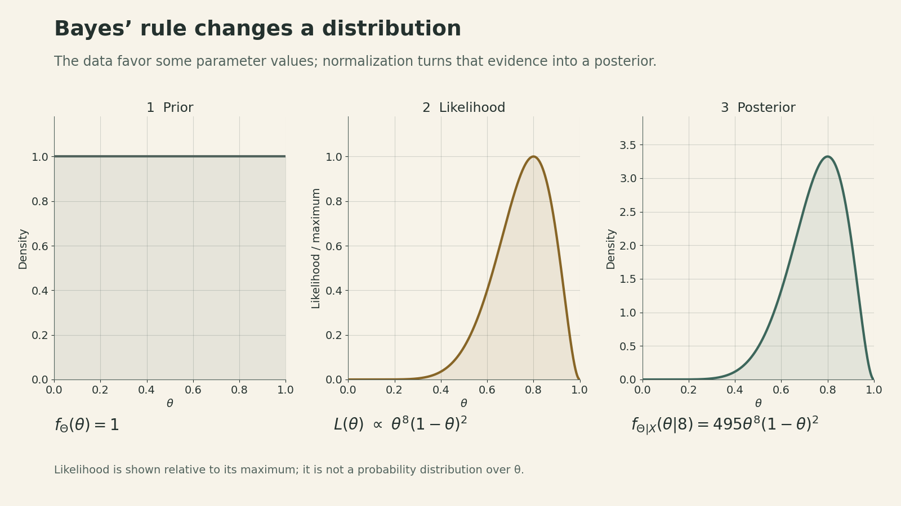
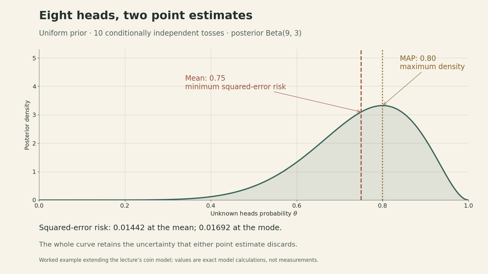
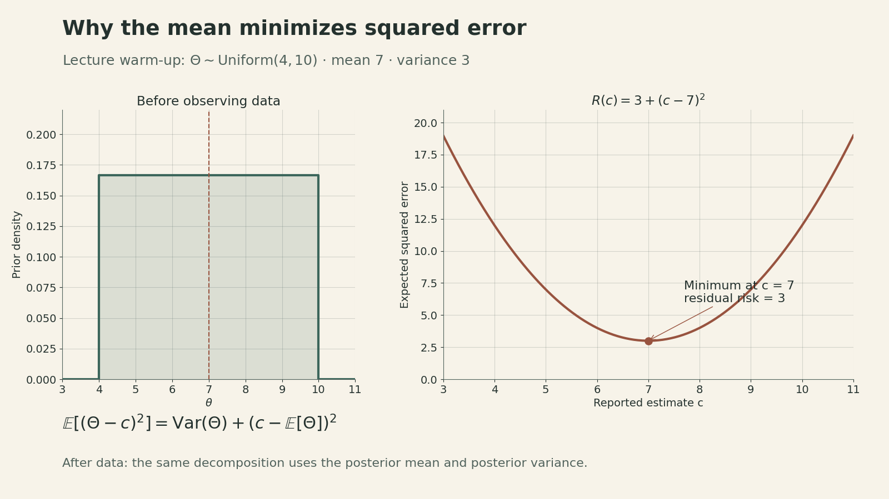

Notes on [**MIT 6.041SC, Lecture 21: Bayesian Statistical Inference I**](https://ocw.mit.edu/courses/6-041sc-probabilistic-systems-analysis-and-applied-probability-fall-2013/pages/unit-iv/lecture-21/), taught by John Tsitsiklis.

A coin produces eight heads in ten tosses. Should its heads probability be estimated as **0.80 or 0.75**? Under a uniform prior, both answers come from the same posterior distribution. The first is its mode; the second is its mean. Which one to report depends on what an error costs.

The [previous lecture](https://ickma2311.github.io/Math/Probability/mit-6041-lecture20-central-limit-theorem.html) studied sampling fluctuations. This lecture turns the direction around: **given the observations, what can we say about an unknown quantity?** Bayesian inference answers with a distribution. A point estimate is a further decision made from that distribution.

<iframe style="width:100%;aspect-ratio:16/9;border:0" src="https://www.youtube-nocookie.com/embed/1jDBM9UM9xk" title="MIT 6.041SC Lecture 21: Bayesian Statistical Inference I — John Tsitsiklis" loading="lazy" allow="accelerometer; clipboard-write; encrypted-media; gyroscope; picture-in-picture; web-share" allowfullscreen></iframe>

## Start by deciding what is unknown

The lecture places polling, medical trials, recommendation systems, finance, and noisy signal measurements inside the same broad task: use observations to infer something that is hidden. Even a simple model can support two different inference problems:

$$X=aS+W.$$

Here $S$ is a signal, $a$ is a gain or attenuation factor, $W$ is noise, and $X$ is the measurement. Send a known signal and infer $a$: this is model identification. Know $a$ and infer the transmitted $S$: this is signal estimation. The practical questions differ, but both require a model connecting an unknown quantity to observations.

A second distinction concerns the goal. **Hypothesis testing** chooses among discrete alternatives, such as whether a signal is present. **Estimation** reports a numerical quantity, such as a population fraction or position. Counting incorrect decisions and measuring their size are different objectives.

In the classical framework, a parameter $\theta$ is fixed but unknown, and the observations have a distribution $p_X(x;\theta)$ or $f_X(x;\theta)$. In the Bayesian framework, uncertainty about the parameter is represented by a random variable $\Theta$ with a prior distribution. This need not claim that a physical constant changes randomly; the distribution can express uncertainty about its fixed value. In either framework, an estimator $g(X)$ is random before the data are observed, because its input is random. Once $X=x$ is observed, $g(x)$ is a number.

## Bayes’ rule produces a posterior

The prior describes uncertainty before the measurement. The likelihood describes how observations are generated for each possible parameter value. Combining them gives the conditional distribution of the unknown quantity after observing the data.

For a continuous parameter and discrete observation,

$$
\begin{aligned}
f_{\Theta\mid X}(\theta\mid x)
&=\frac{f_\Theta(\theta)p_{X\mid\Theta}(x\mid\theta)}{p_X(x)},\\
p_X(x)&=\int f_\Theta(u)p_{X\mid\Theta}(x\mid u)\,du.
\end{aligned}
$$

The denominator normalizes the numerator and does not depend on $\theta$. Its value must be positive for the observed event. If the parameter is discrete, use its PMF and a sum; if the observations are continuous, use their conditional density. A likelihood is a function of the parameter for fixed data. It does not become a probability distribution over the parameter until the prior and normalization are included.

The result is the **posterior distribution**, not yet a single estimate. It can show a broad plausible range, multiple modes, or a small chance of an extreme value. One number cannot retain all of this information.

## A coin makes the distinction concrete

To extend the lecture’s coin example numerically, take $n=10$ conditionally independent tosses with the same unknown heads probability $\Theta$, and observe a count $X=8$. Choose the uniform prior on $[0,1]$. The likelihood is

$$p_{X\mid\Theta}(8\mid\theta)=\binom{10}{8}\theta^8(1-\theta)^2.$$

The binomial coefficient is constant in $\theta$ and cancels during normalization. The posterior is

$$
\begin{aligned}
f_{\Theta\mid X}(\theta\mid8)&=495\theta^8(1-\theta)^2,\\
&\qquad 0\leq\theta\leq1.
\end{aligned}
$$

This is a Beta$(9,3)$ distribution. More generally, a uniform prior and $h$ heads in $n$ such tosses give Beta$(h+1,n-h+1)$. The uniform prior is a modeling choice; it is not a consequence of having little data.

{fig-alt="Three panels show a uniform prior, a likelihood proportional to theta to the eighth times one minus theta squared, and the normalized Beta(9,3) posterior. The likelihood panel is scaled by its maximum, whereas the other panels are densities."}

In this example, the posterior mode is $8/10=0.80$, whereas the posterior mean is $9/12=0.75$. The mean combines the data with the uniform prior; it should not be confused with a claim that the true probability has been determined exactly. Under this model, it also gives the predictive probability of heads on the next conditionally independent toss.

## MAP: choose the largest posterior mass or density

For a discrete unknown, a maximum a posteriori probability (MAP) decision is

$$\hat\theta_{\mathrm{MAP}}(x)\in\arg\max_\theta p_{\Theta\mid X}(\theta\mid x).$$

If every wrong decision costs one unit and a correct decision costs zero, reporting $a$ has posterior expected loss $1-p_{\Theta\mid X}(a\mid x)$. Maximizing that probability therefore minimizes the probability of an incorrect decision. Unequal costs can lead to a different choice.

For a continuous unknown, MAP maximizes **posterior density**. Each exact point has probability zero, so the density peak cannot be justified as the point with the greatest nonzero probability of being exactly correct. It is a way to summarize the shape of a density. It does not generally minimize squared error.

{fig-alt="The Beta(9,3) posterior density has a dotted line at its mode 0.80 and a dashed line at its mean 0.75. Its conditional squared-error risk is about 0.01692 at the mode and 0.01442 at the mean."}

For our coin, differentiate $8\log\theta+2\log(1-\theta)$ to locate the interior mode: $8/\theta-2/(1-\theta)=0$, hence $\hat\theta_{\mathrm{MAP}}=0.80$. The posterior mean is $0.75$. The estimates differ because finding a peak and finding a balance point are different operations.

## Squared error: choose the posterior mean

Suppose the cost is the squared estimation error and $\mathbb E[\Theta^2]$ is finite. For any constant $c$, expanding around the mean gives

$$
\begin{aligned}
\mathbb E[(\Theta-c)^2]
&=\operatorname{Var}(\Theta)\\
&\quad+(c-\mathbb E[\Theta])^2.
\end{aligned}
$$

The cross term vanishes because $\mathbb E[\Theta-\mathbb E[\Theta]]=0$. The second term is nonnegative and is zero precisely at the mean. In the lecture’s warm-up, $\Theta\sim\mathrm{Uniform}(4,10)$: the optimal estimate is $7$, and its minimum mean squared error is $(10-4)^2/12=3$. This is an average squared error, not a promise that every realization lies close to 7.

{fig-alt="A uniform density on 4 to 10 is paired with the risk curve R(c)=3+(c-7)^2. The minimum occurs at c=7 and has value 3."}

After observing $X=x$, repeat the same argument inside the conditional distribution:

$$
\begin{aligned}
&\mathbb E[(\Theta-c)^2\mid X=x]\\
&\quad=\operatorname{Var}(\Theta\mid X=x)\\
&\qquad+(c-\mathbb E[\Theta\mid X=x])^2.
\end{aligned}
$$

Thus the least mean squares (LMS), or minimum mean squared error (MMSE), estimator is $\hat\Theta=\mathbb E[\Theta\mid X]$. Its conditional risk is the posterior variance. Averaging the conditional inequality over $X$ proves that it minimizes the overall Bayes mean squared error among all measurable estimators with finite risk:

$$
\mathbb E[(\Theta-\mathbb E[\Theta\mid X])^2]
\leq\mathbb E[(\Theta-g(X))^2].
$$

For Beta$(9,3)$, the posterior variance is $3/208\approx0.01442$. Reporting $0.80$ adds $(0.80-0.75)^2=0.0025$, giving risk $\approx0.01692$. The mean has smaller expected squared error under the assumed model; it need not be closer to the unknown truth on every individual occasion.

## Several measurements: the rule survives, the calculation grows

With observations $X_1,\ldots,X_n$, the squared-error answer is still $\mathbb E[\Theta\mid X_1,\ldots,X_n]$. The observations need not be independent for this result; dependence belongs in the joint likelihood. Conditional independence is a separate modeling assumption used in the coin calculation.

The lecture’s trajectory example makes the dimensional issue visible:

$$
\begin{aligned}
Z_t&=\Theta_0+t\Theta_1+t^2\Theta_2,\\
X_t&=Z_t+W_t.
\end{aligned}
$$

Inference now produces a joint posterior for the three coefficients given all measurements. Under a summed squared-error loss, the estimate is the vector of posterior conditional means. The compact notation can hide difficult multidimensional integrals.

A prior, a likelihood, and a loss function each do a different job. The first two determine what the model says is plausible; the loss determines which action is preferable. Reliable inference requires examining those choices and retaining enough of the posterior to show the uncertainty that a point estimate leaves behind.

## Sources

- [MIT OCW Lecture 21 course page](https://ocw.mit.edu/courses/6-041sc-probabilistic-systems-analysis-and-applied-probability-fall-2013/pages/unit-iv/lecture-21/)
- [Official lecture slides](https://ocw.mit.edu/courses/6-041sc-probabilistic-systems-analysis-and-applied-probability-fall-2013/e581867107d8494749a2ced11ad812ff_MIT6_041SCF13_L21.pdf)
- [Official lecture transcript](https://ocw.mit.edu/courses/6-041sc-probabilistic-systems-analysis-and-applied-probability-fall-2013/2e51f9b760244a869e5baf3454ad3599_MIT6_041SCF13_lec21_300k.pdf)
- [Lecture video](https://www.youtube.com/watch?v=1jDBM9UM9xk)
