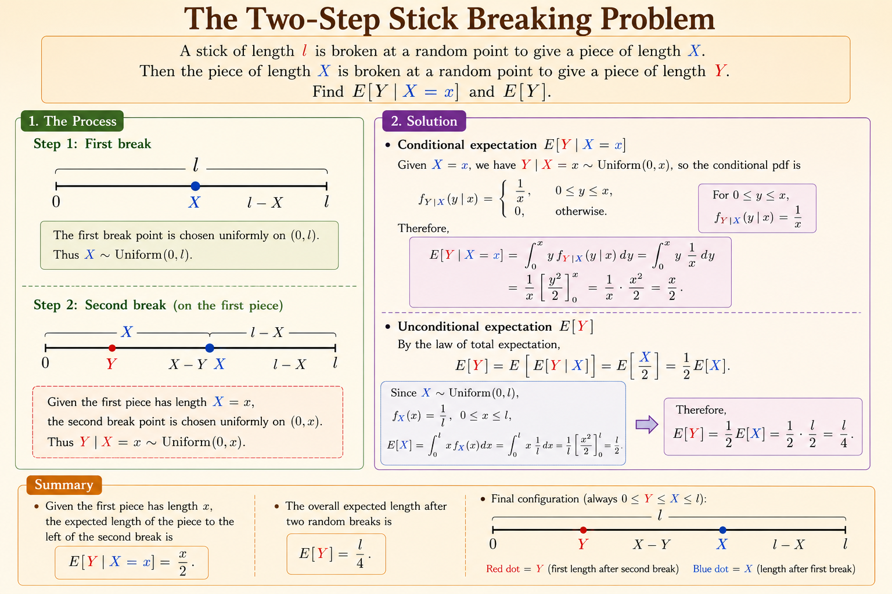

<iframe width="100%" height="500" src="https://www.youtube.com/embed/CadZXGNauY0" title="MIT 6.041 Probability: Multiple Continuous Random Variables" frameborder="0" allowfullscreen></iframe>

## Joint PDFs

For two continuous random variables, probabilities are described by a joint density over the plane.

$$
P((X,Y) \in S) = \iint_S f_{X,Y}(x,y)\,dx\,dy
$$

Geometrically, the probability that $(X,Y)$ lands in a set $S$ is the volume under the joint PDF surface above that region.

For a very small square near $(x,y)$,

$$
P(x \le X \le x+\delta,\ y \le Y \le y+\delta)
\approx f_{X,Y}(x,y)\delta^2.
$$

This is the two-dimensional version of the density-times-length approximation for one continuous random variable. A point still has probability zero; probability appears only after integrating density over an area.

### Expectations

For any function $g(X,Y)$,

$$
E[g(X,Y)] =
\int_{-\infty}^{\infty}
\int_{-\infty}^{\infty}
g(x,y) f_{X,Y}(x,y)\,dx\,dy.
$$

This is the continuous analogue of summing $g(x,y)p_{X,Y}(x,y)$ over all possible pairs. The mechanics change from sums to integrals, but the idea is identical: evaluate the function everywhere and weight each value by the probability model.

### Marginal PDFs

The marginal density of $X$ is obtained by integrating out $Y$:

$$
f_X(x) = \int_{-\infty}^{\infty} f_{X,Y}(x,y)\,dy.
$$

Similarly,

$$
f_Y(y) = \int_{-\infty}^{\infty} f_{X,Y}(x,y)\,dx.
$$

Marginalization collapses the joint surface along one axis. It keeps the probability law for one variable while ignoring the other.

### Independence

Continuous random variables $X$ and $Y$ are independent if the joint PDF factors:

$$
f_{X,Y}(x,y) = f_X(x)f_Y(y)
$$

for all relevant $x$ and $y$. If this factorization holds, knowing $X$ does not change the density of $Y$, and knowing $Y$ does not change the density of $X$.

## Buffon's Needle Experiment

Buffon's needle asks for the probability that a randomly dropped needle intersects one of a set of parallel lines.

Let:

- $d$ be the distance between neighboring parallel lines.
- $\ell$ be the needle length.
- $\ell < d$, so the needle can cross at most one line.

Use two random variables:

- $X$: the perpendicular distance from the midpoint of the needle to the nearest line, with $0 \le X \le d/2$.
- $\Theta$: the acute angle between the needle and the parallel lines, with $0 \le \Theta \le \pi/2$.

The random drop model treats $X$ and $\Theta$ as uniform and independent:

$$
f_X(x) = \frac{2}{d},
\qquad
f_\Theta(\theta) = \frac{2}{\pi}.
$$

Therefore,

$$
f_{X,\Theta}(x,\theta) =
\frac{4}{\pi d},
\qquad
0 \le x \le d/2,\ 0 \le \theta \le \pi/2.
$$

The needle intersects a line when the midpoint is close enough to a line:

$$
X \le \frac{\ell}{2}\sin \Theta.
$$

Thus,

$$
P(\text{intersection})
=
\frac{4}{\pi d}
\int_0^{\pi/2}
\int_0^{(\ell/2)\sin\theta}
1\,dx\,d\theta.
$$

Evaluating,

$$
\begin{aligned}
P(\text{intersection})
&=
\frac{4}{\pi d}
\int_0^{\pi/2}
\frac{\ell}{2}\sin\theta\,d\theta \\
&=
\frac{2\ell}{\pi d}
\int_0^{\pi/2}\sin\theta\,d\theta \\
&=
\frac{2\ell}{\pi d}.
\end{aligned}
$$

This example shows how geometry defines the integration region, while the joint PDF supplies the density over that region.

## Conditional PDFs

For continuous random variables, conditioning on an exact value is handled through conditional density rather than point probability.

By analogy with

$$
P(x \le X \le x+\delta) \approx f_X(x)\delta,
$$

we write

$$
P(x \le X \le x+\delta \mid Y \approx y)
\approx f_{X\mid Y}(x\mid y)\delta.
$$

The formal definition is:

$$
f_{X\mid Y}(x\mid y)
=
\frac{f_{X,Y}(x,y)}{f_Y(y)},
\qquad f_Y(y) > 0.
$$

The intuition is a slice-and-renormalize operation. Fixing $Y=y$ takes a one-dimensional slice through the joint PDF surface. Dividing by $f_Y(y)$ normalizes that slice so it integrates to one and becomes a valid PDF for $X$ under the condition.

### Independence and Conditioning

If $X$ and $Y$ are independent, then

$$
f_{X,Y}(x,y) = f_X(x)f_Y(y).
$$

Substituting into the conditional PDF,

$$
f_{X\mid Y}(x\mid y)
=
\frac{f_X(x)f_Y(y)}{f_Y(y)}
=
f_X(x).
$$

So conditioning on $Y=y$ does not change the distribution of $X$.

## Example: Two-Step Stick Breaking

Suppose a stick has total length $\ell$.

1. Break it at a uniformly random point $X$ along the original stick.
2. Take the piece of length $X$ and break it again at a uniformly random point $Y$.

The first break has marginal PDF

$$
f_X(x) = \frac{1}{\ell},
\qquad 0 \le x \le \ell.
$$

Given $X=x$, the second break is uniform on $[0,x]$:

$$
f_{Y\mid X}(y\mid x) = \frac{1}{x},
\qquad 0 \le y \le x.
$$

The joint PDF is therefore

$$
f_{X,Y}(x,y)
=
f_X(x)f_{Y\mid X}(y\mid x)
=
\frac{1}{\ell x},
$$

on the triangular support

$$
0 \le y \le x \le \ell.
$$

### Conditional Expectation

Given the first break $X=x$,

$$
\begin{aligned}
E[Y\mid X=x]
&=
\int_0^x y f_{Y\mid X}(y\mid x)\,dy \\
&=
\int_0^x y\frac{1}{x}\,dy \\
&=
\frac{x}{2}.
\end{aligned}
$$

This matches the intuition: if $Y$ is uniform on a segment of length $x$, its average location is halfway along the segment.

### Marginal PDF of the Second Break

For a fixed $y$, the first break $x$ must range from $y$ to $\ell$. Therefore,

$$
\begin{aligned}
f_Y(y)
&=
\int_y^\ell f_{X,Y}(x,y)\,dx \\
&=
\int_y^\ell \frac{1}{\ell x}\,dx \\
&=
\frac{1}{\ell}\ln\left(\frac{\ell}{y}\right),
\qquad 0 < y \le \ell.
\end{aligned}
$$

The density becomes large near zero because small second-break lengths can occur through many possible first-break lengths.

### Total Expectation

Using the marginal density,

$$
E[Y]
=
\int_0^\ell y f_Y(y)\,dy
=
\frac{1}{\ell}\int_0^\ell y\ln\left(\frac{\ell}{y}\right)\,dy.
$$

Integration by parts gives

$$
E[Y] = \frac{\ell}{4}.
$$

The intuition is even simpler:

$$
E[Y] = E[E[Y\mid X]] = E\left[\frac{X}{2}\right] = \frac{1}{2}E[X] = \frac{\ell}{4}.
$$

## Summary

Multiple continuous random variables extend the one-dimensional PDF idea to surfaces. Joint PDFs assign density over regions, marginal PDFs integrate out variables, conditional PDFs slice and renormalize the joint density, and independence corresponds to factorization. Buffon's needle and stick breaking show the same pattern: define the valid geometric region first, then integrate the appropriate density over that region.
