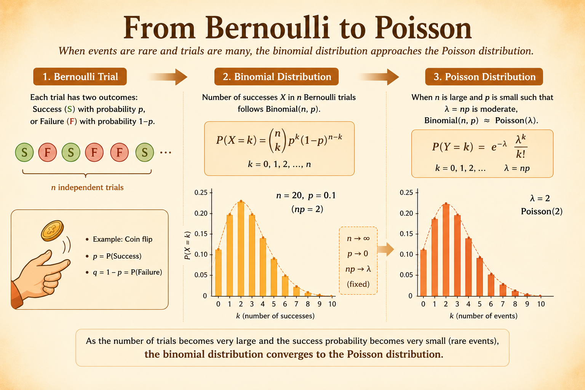

<iframe width="100%" height="500" src="https://www.youtube.com/embed/jsqSScywvMc" title="MIT 6.041 Probability: Poisson Process I" frameborder="0" allowfullscreen></iframe>

A **Poisson process** is a continuous-time model for random arrivals.

It is the continuous analogue of a Bernoulli process: instead of checking whether an arrival happens in each discrete slot, we count arrivals over continuous time intervals.

# Definition

Let $N(t)$ be the number of arrivals by time $t$. For an interval of length $\tau$,

$$
P(k,\tau)
=
\Pr(N(t+\tau)-N(t)=k).
$$

The process is characterized by three ideas:

- **Homogeneity:** the distribution depends only on the interval length $\tau$, not on where the interval starts.
- **Independent increments:** numbers of arrivals in disjoint intervals are independent.
- **Small-interval behavior:** in a tiny interval, either no arrival happens or one arrival happens; two or more arrivals are negligible.

For a fixed interval length $\tau$,

$$
\sum_{k=0}^{\infty} P(k,\tau)=1.
$$

# Small Interval Probabilities

For a very small interval of length $\delta$,

$$
P(k,\delta)
\approx
\begin{cases}
1-\lambda\delta, & k=0,\\
\lambda\delta, & k=1,\\
0, & k>1.
\end{cases}
$$

Here $\lambda$ is the arrival rate per unit time.

Intuition:

- $\lambda\delta$ is the approximate probability of one arrival in a tiny interval.
- $1-\lambda\delta$ is the approximate probability of no arrival.
- The probability of more than one arrival in a tiny interval is approximately zero.

# From Bernoulli to Poisson

The Poisson PMF can be derived as a limit of binomial probabilities.

## Step 1: Discretize Time

Take an interval of length $\tau$ and divide it into $n$ small slots:

$$
\delta = \frac{\tau}{n}.
$$

As $n\to\infty$, the slot length $\delta\to 0$.

## Step 2: Match the Arrival Rate

Approximate each small slot as a Bernoulli trial with success probability

$$
p = \lambda\delta
=
\lambda\left(\frac{\tau}{n}\right)
=
\frac{\lambda\tau}{n}.
$$

Then the expected number of arrivals in the whole interval is

$$
np
=
n\left(\frac{\lambda\tau}{n}\right)
=
\lambda\tau.
$$

## Step 3: Start from the Binomial PMF

If the $n$ tiny slots are independent Bernoulli trials, then

$$
P(K_n=k)
=
\binom{n}{k}p^k(1-p)^{n-k}.
$$

Substitute $p=\lambda\tau/n$:

$$
P(K_n=k)
=
\binom{n}{k}
\left(\frac{\lambda\tau}{n}\right)^k
\left(1-\frac{\lambda\tau}{n}\right)^{n-k}.
$$

## Step 4: Take the Limit

For fixed $k$,

$$
\binom{n}{k}
=
\frac{n(n-1)\cdots(n-k+1)}{k!}.
$$

So

$$
P(K_n=k)
=
\frac{n(n-1)\cdots(n-k+1)}{k!}
\left(\frac{\lambda\tau}{n}\right)^k
\left(1-\frac{\lambda\tau}{n}\right)^n
\left(1-\frac{\lambda\tau}{n}\right)^{-k}.
$$

As $n\to\infty$:

$$
\frac{n(n-1)\cdots(n-k+1)}{n^k}\to 1,
$$

$$
\left(1-\frac{\lambda\tau}{n}\right)^n
\to
e^{-\lambda\tau},
$$

and

$$
\left(1-\frac{\lambda\tau}{n}\right)^{-k}\to 1.
$$

Therefore,

$$
P(K=k)
=
\frac{(\lambda\tau)^k e^{-\lambda\tau}}{k!},
\qquad
k=0,1,2,\ldots
$$

# Example: Email Arrivals

Suppose emails arrive according to a Poisson process with rate

$$
\lambda=5
$$

messages per hour. You check email every 30 minutes, so $\tau=1/2$ and

$$
\lambda\tau = 5\cdot\frac{1}{2}=2.5.
$$

The probability of no new messages is

$$
P(0,1/2)
=
\frac{(2.5)^0}{0!}e^{-2.5}
=
e^{-2.5}
\approx
0.082.
$$

The probability of exactly one new message is

$$
P(1,1/2)
=
\frac{(2.5)^1}{1!}e^{-2.5}
=
2.5e^{-2.5}
\approx
0.205.
$$

# Interarrival Times

Let $X_i$ be the time between the $(i-1)$st arrival and the $i$th arrival. For a Poisson process with rate $\lambda$,

$$
X_i \sim \operatorname{Exponential}(\lambda),
\qquad
f_X(x)=\lambda e^{-\lambda x},
\quad x\ge 0.
$$

The interarrival times are independent and identically distributed. This is the continuous-time memoryless structure behind the Poisson process.

## Time of the kth Arrival

Let $Y_k$ be the time from the start of the process until the $k$th arrival. Then

$$
Y_k = X_1 + X_2 + \cdots + X_k.
$$

Because $Y_k$ is the sum of $k$ independent exponential random variables with rate $\lambda$,

$$
Y_k \sim \operatorname{Erlang}(k,\lambda),
$$

with density

$$
f_{Y_k}(y)
=
\frac{\lambda^k y^{k-1}e^{-\lambda y}}{(k-1)!},
\qquad y\ge 0.
$$

For $k=1$, this reduces to the exponential density:

$$
f_{Y_1}(y)
=
\lambda e^{-\lambda y},
\qquad y\ge 0.
$$

## Memorylessness

The exponential interarrival time is memoryless:

$$
\Pr(X>s+t\mid X>s)=\Pr(X>t).
$$

Intuition: if no arrival has happened yet, the remaining waiting time has the same distribution as if the process just started.

# Bernoulli and Poisson Relation

The Poisson process can be viewed as the limit of a Bernoulli process under rare events and many trials:

- Divide continuous time into tiny slots of length $\delta$.
- Treat each slot as a Bernoulli trial with success probability $p=\lambda\delta$.
- Let $\delta\to 0$ while keeping $\lambda\tau$ fixed.

| Concept | Poisson process | Bernoulli process |
|---|---|---|
| Time model | Continuous | Discrete |
| Arrival rate | $\lambda$ per unit time | $p$ per trial |
| Count distribution | Poisson | Binomial |
| First arrival time | Exponential | Geometric |
| Time to kth arrival | Erlang | Negative binomial |

# Merging

If two independent Poisson processes have rates $\lambda_1$ and $\lambda_2$, then their merged process is also Poisson.

The merged rate is

$$
\lambda_{\text{total}}
=
\lambda_1+\lambda_2.
$$

Given that an arrival occurred in the merged process, the probability that it came from process 1 is proportional to its rate:

$$
\Pr(\text{from process 1}\mid \text{arrival})
=
\frac{\lambda_1}{\lambda_1+\lambda_2}.
$$

# Takeaways

- The Poisson process models random arrivals in continuous time.
- Counts in a fixed interval follow a Poisson distribution.
- Interarrival times are independent exponential random variables.
- The time to the kth arrival follows an Erlang distribution.
- Independent Poisson processes merge into another Poisson process with rates added.

*Source: MIT 6.041 Probabilistic Systems Analysis and Applied Probability, Poisson Process I.*
