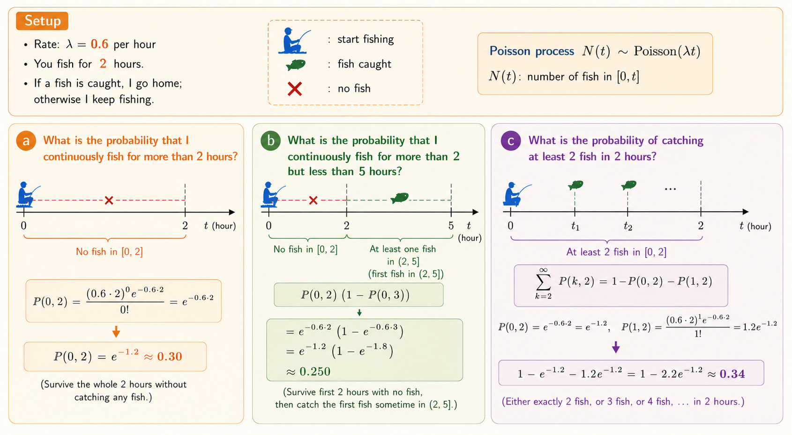

<iframe width="100%" height="500" src="https://www.youtube.com/embed/XsYXACeIklU" title="MIT 6.041 Probability: Poisson Process II" frameborder="0" allowfullscreen></iframe>

This lecture applies Poisson-process ideas to stopping rules, competing exponential clocks, and random arrival observations. The examples connect event counts, memoryless waiting times, and the bias introduced by observing a process at a random time.

# Fishing with a Stopping Rule

Suppose fish are caught according to a Poisson process with rate

$$
\lambda=0.6
$$

fish per hour. You always fish for two hours. If at least one fish is caught, you go home at time $2$; otherwise, you continue until the first fish is caught.

Let $N(t)$ denote the number of fish caught by time $t$. Then

$$
N(t)\sim\operatorname{Poisson}(\lambda t),
$$

and

$$
P(k,t)=\Pr(N(t)=k)
=
\frac{(\lambda t)^k e^{-\lambda t}}{k!}.
$$

## Fishing for More Than Two Hours

You continue beyond two hours exactly when no fish is caught during $[0,2]$:

$$
\Pr(T>2)
=
P(0,2)
=
e^{-0.6\cdot2}
=
e^{-1.2}
\approx 0.301.
$$

## Fishing Between Two and Five Hours

This event requires no fish in the first two hours and at least one fish during the next three hours. Independent increments give

$$
\begin{aligned}
\Pr(2<T<5)
&=P(0,2)\bigl(1-P(0,3)\bigr)\\
&=e^{-1.2}\left(1-e^{-1.8}\right)\\
&\approx0.251.
\end{aligned}
$$

## At Least Two Fish in Two Hours

Use the complement of zero or one arrival:

$$
\begin{aligned}
\Pr(N(2)\ge2)
&=1-P(0,2)-P(1,2)\\
&=1-e^{-1.2}-1.2e^{-1.2}\\
&\approx0.337.
\end{aligned}
$$

## Expected Number of Fish

The expected number caught during the first two hours is

$$
E[N(2)]=\lambda\cdot2=1.2.
$$

If no fish is caught by time $2$, the policy guarantees exactly one additional fish before stopping. Therefore,

$$
\begin{aligned}
E[N(T)]
&=E[N(2)]+\Pr(N(2)=0)\\
&=1.2+e^{-1.2}\\
&\approx1.501.
\end{aligned}
$$

## Expected Fishing Time

Starting from any time, the expected wait for the next fish is

$$
\frac{1}{\lambda}=\frac{1}{0.6}\approx1.667\text{ hours}.
$$

The extra wait occurs only when no fish arrives in the first two hours. Hence

$$
\begin{aligned}
E[T]
&=2+P(0,2)\frac{1}{\lambda}\\
&=2+e^{-1.2}\frac{1}{0.6}\\
&\approx2.502\text{ hours}.
\end{aligned}
$$

# Competing Exponentials: Light Bulbs

Install three light bulbs at the same time. Assume their independent lifetimes are

$$
X_1,X_2,X_3\sim\operatorname{Exponential}(\lambda).
$$

We want the expected time until the last bulb burns out:

$$
E[\max(X_1,X_2,X_3)].
$$

## Time Until the First Failure

The first failure is the minimum of three independent exponential clocks. Their rates add, so

$$
\min(X_1,X_2,X_3)
\sim
\operatorname{Exponential}(3\lambda),
$$

with expected waiting time

$$
\frac{1}{3\lambda}.
$$

## After Each Failure

After the first bulb fails, two remain. By memorylessness, their residual lifetimes are again independent exponentials with rate $\lambda$. The next failure therefore has expected additional wait

$$
\frac{1}{2\lambda}.
$$

Once only one bulb remains, its expected additional lifetime is

$$
\frac{1}{\lambda}.
$$

Thus,

$$
\begin{aligned}
E[\max(X_1,X_2,X_3)]
&=\frac{1}{3\lambda}+\frac{1}{2\lambda}+\frac{1}{\lambda}\\
&=\frac{11}{6\lambda}.
\end{aligned}
$$

The argument works because independent exponential clocks compete through the sum of their rates, while memorylessness resets the problem after each failure.

# Bus Arrivals and Length Bias

Suppose bus interarrival times are equally likely to be five or ten minutes:

$$
\Pr(L=5)=\Pr(L=10)=\frac12.
$$

If you arrive at a uniformly random time, you are more likely to land inside a long interval because it occupies more of the timeline.

## Which Interval Do You Observe?

The observed interval has the length-biased distribution

$$
\Pr(L^*=\ell)
=
\frac{\ell\Pr(L=\ell)}{E[L]}.
$$

Since $E[L]=7.5$,

$$
\Pr(L^*=5)
=
\frac{5(1/2)}{7.5}
=
\frac13,
$$

and

$$
\Pr(L^*=10)=\frac23.
$$

## Expected Wait to the Next Bus

Conditional on being inside an interval of length $\ell$, a random observation point has expected residual wait $\ell/2$. Therefore,

$$
\begin{aligned}
E[W]
&=\frac13\left(\frac52\right)
+\frac23\left(\frac{10}{2}\right)\\
&=\frac{25}{6}\\
&\approx4.17\text{ minutes}.
\end{aligned}
$$

The value $7.5$ minutes answers a different question: it is the expected next interval length if you arrive immediately after a bus departs. A random-time observer sees length bias and then arrives partway through the selected interval.

# Key Takeaways

- Poisson counts and exponential waiting times describe the same arrival process from two perspectives.
- Independent increments make probabilities over consecutive time intervals easy to factor.
- Memorylessness lets a stopping problem restart after an arrival or failure.
- The minimum of independent exponential clocks is exponential with the sum of their rates.
- Sampling a process at a random time favors longer intervals, producing length bias.
