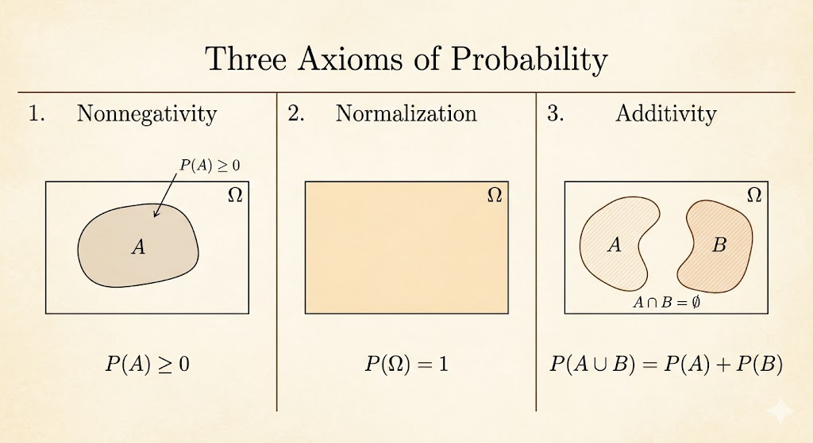

<iframe width="100%" height="500" src="https://www.youtube.com/embed/j9WZyLZCBzs" title="MIT 6.041 Probability" frameborder="0" allowfullscreen></iframe>

## Sample Space $\Omega$

The sample space is the set of all possible outcomes of an experiment.

Two key properties:

- outcomes should be mutually exclusive
- outcomes should be collectively exhaustive

Examples:

- flipping a coin: `{H, T}`
- rolling a 4-sided die: `{1,2,3,4}`

## Discrete Example

Consider rolling a 4-sided die twice.

### Outcome Table

| 1st \\ 2nd | 1 | 2 | 3 | 4 |
|---|---|---|---|---|
| 1 | (1,1) | (1,2) | (1,3) | (1,4) |
| 2 | (2,1) | (2,2) | (2,3) | (2,4) |
| 3 | (3,1) | (3,2) | (3,3) | (3,4) |
| 4 | (4,1) | (4,2) | (4,3) | (4,4) |

### Sequential Description

```{mermaid}
graph LR
    Start((Start)) --> A1((1))
    Start --> A2((2))
    Start --> A3((3))
    Start --> A4((4))

    A1 --> A11["(1,1)"]
    A1 --> A12["(1,2)"]
    A1 --> A13["(1,3)"]
    A1 --> A14["(1,4)"]

    A2 --> A21["(2,1)"]
    A2 --> A22["(2,2)"]
    A2 --> A23["(2,3)"]
    A2 --> A24["(2,4)"]

    A3 --> More1["..."]
    A4 --> More2["..."]
```

The table and the tree describe the same sample space. One is geometric, the other is sequential.

## Continuous Example

For a continuous model,

$$
\Omega = \{(x,y)\mid 0 \le x,y \le 1\}.
$$

The probability of any exact point is `0`, because a point has no area.

So in continuous probability, we do not assign probability to single points. We assign probability to regions.

## Axioms

The core axioms are:

- nonnegativity: $P(A) \ge 0$
- normalization: $P(\Omega) = 1$
- additivity: if $A \cap B = \emptyset$, then $P(A \cup B) = P(A) + P(B)$

For infinite sample spaces, this extends to countable additivity:

If $A_1, A_2, \dots$ are disjoint, then

$$
P(A_1 \cup A_2 \cup \cdots) = P(A_1) + P(A_2) + \cdots
$$

From the axioms we can derive useful facts. For example, probability is always at most `1`.

Since

$$
P(\Omega) = P(A) + P(A^c) = 1
$$

and

$$
P(A^c) \ge 0,
$$

it follows that

$$
P(A) \le 1.
$$



## Exercise

Use the `4 x 4` dice example, where each outcome has probability `1/16`.

| Y \\ X | 1 | 2 | 3 | 4 |
|---|---|---|---|---|
| 4 | (1,4) | (2,4) | (3,4) | (4,4) |
| 3 | (1,3) | (2,3) | (3,3) | (4,3) |
| 2 | (1,2) | (2,2) | (3,2) | (4,2) |
| 1 | (1,1) | (2,1) | (3,1) | (4,1) |

Examples:

- $P\big((X,Y)\in\{(1,1),(1,2)\}\big)=\frac{2}{16}=\frac{1}{8}$
- $P(X=1)=\frac{4}{16}=\frac{1}{4}$
- $P(X+Y \text{ is odd})=\frac{8}{16}=\frac{1}{2}$
- $P(\min(X,Y)=2)=\frac{5}{16}$

## Discrete Uniform Law

If all outcomes are equally likely, then

$$
P(A)=\frac{\text{number of elements of }A}{\text{total number of sample points}}.
$$

So computing probability becomes a counting problem.

## Continuous Uniform Law

In a continuous uniform model, probability is proportional to length, area, or volume.

That is why:

- a single point has probability `0`
- intervals or regions can have positive probability

For continuous models, probability is geometric rather than combinatorial.

## Takeaways

- the sample space is the formal description of all possible outcomes
- discrete and continuous models behave differently: counting versus geometry
- the probability axioms are simple, but they generate the whole framework
- uniform probability reduces many problems to either counting or area
