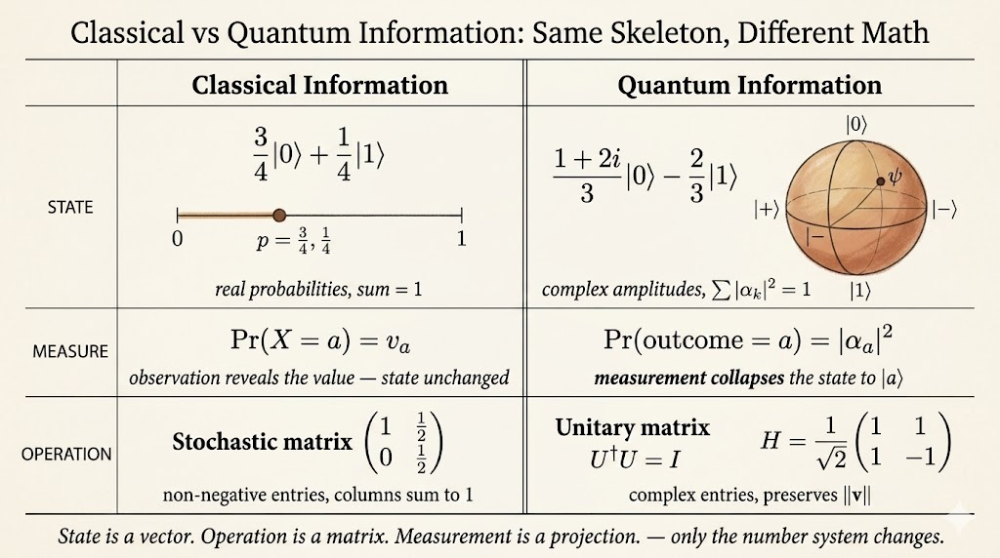

<iframe width="100%" height="500" src="https://www.youtube.com/embed/3-c4xJa7Flk?list=PLOFEBzvs-VvqKKMXX4vbi4EB1uaErFMSO&amp;index=4" title="Qiskit Lesson 1" frameborder="0" allowfullscreen></iframe>

This lesson starts quantum information from the classical case.

That is a useful entry point. Before introducing qubits, amplitudes, and unitary operations, we first describe ordinary classical systems with finite states, probability vectors, and matrices.

The contrast is the main idea:

- classical uncertainty is represented by probabilities
- quantum states are represented by complex amplitudes
- classical operations use stochastic matrices
- quantum operations use unitary matrices
- measurement turns a quantum state into a classical outcome

## Classical States

Assume a system $X$ can be in one of finitely many classical states. Let the classical state set be $\Sigma$.

Examples:

- for a bit, $\Sigma=\{0,1\}$
- for a six-sided die, $\Sigma=\{1,2,3,4,5,6\}$
- for a fan switch, $\Sigma=\{\text{high},\text{medium},\text{low},\text{off}\}$

If the state is known exactly, the system is in one of these classical states.

If the state is uncertain, each state has a probability associated with it.

For a bit that is $0$ with probability $3/4$ and $1$ with probability $1/4$, the probability vector is:

$$
\begin{pmatrix}
3/4 \\
1/4
\end{pmatrix}.
$$

A probability vector has two properties:

- every entry is nonnegative
- the entries sum to 1

## Dirac Notation for Classical States

Dirac notation gives a clean way to write basis vectors.

For each $a\in\Sigma$, the ket $|a\rangle$ is the column vector with a 1 in the entry corresponding to $a$ and 0 everywhere else.

For a bit:

$$
|0\rangle =
\begin{pmatrix}
1 \\
0
\end{pmatrix},
\qquad
|1\rangle =
\begin{pmatrix}
0 \\
1
\end{pmatrix}.
$$

For a four-state system such as card suits:

$$
|\clubsuit\rangle =
\begin{pmatrix}1\\0\\0\\0\end{pmatrix},
\quad
|\diamondsuit\rangle =
\begin{pmatrix}0\\1\\0\\0\end{pmatrix},
\quad
|\heartsuit\rangle =
\begin{pmatrix}0\\0\\1\\0\end{pmatrix},
\quad
|\spadesuit\rangle =
\begin{pmatrix}0\\0\\0\\1\end{pmatrix}.
$$

The bra $\langle a|$ is the corresponding row vector. For a bit:

$$
\langle 0| = \begin{pmatrix}1 & 0\end{pmatrix},
\qquad
\langle 1| = \begin{pmatrix}0 & 1\end{pmatrix}.
$$

Multiplying a bra by a ket gives a scalar:

$$
\langle a|b\rangle =
\begin{cases}
1, & a=b,\\
0, & a\ne b.
\end{cases}
$$

Multiplying a ket by a bra gives a matrix. For example:

$$
|1\rangle\langle 0|
=
\begin{pmatrix}0\\1\end{pmatrix}
\begin{pmatrix}1 & 0\end{pmatrix}
=
\begin{pmatrix}
0 & 0\\
1 & 0
\end{pmatrix}.
$$

In general, $|a\rangle\langle b|$ is the matrix with a 1 at the $(a,b)$ entry and 0 elsewhere.

## Measuring Classical Probabilistic States

A classical probabilistic state can be written as a linear combination of basis states. For the bit example:

$$
\frac{3}{4}|0\rangle + \frac{1}{4}|1\rangle.
$$

Measuring a classical probabilistic state means observing the actual underlying value.

If:

$$
\Pr(X=0)=\frac{3}{4},
\qquad
\Pr(X=1)=\frac{1}{4},
$$

then measuring returns $0$ with probability $3/4$ and $1$ with probability $1/4$.

In the classical setting, measurement does not physically change the state. It changes our knowledge of the state.

## Deterministic Classical Operations

A deterministic operation is a function:

$$
f:\Sigma\to\Sigma.
$$

For a bit, there are four possible deterministic functions:

| $a$ | $f_1(a)$ | $f_2(a)$ | $f_3(a)$ | $f_4(a)$ |
|---:|---:|---:|---:|---:|
| 0 | 0 | 0 | 1 | 1 |
| 1 | 0 | 1 | 0 | 1 |

These correspond to matrices:

$$
M_1=
\begin{pmatrix}
1 & 1\\
0 & 0
\end{pmatrix},
\quad
M_2=
\begin{pmatrix}
1 & 0\\
0 & 1
\end{pmatrix},
\quad
M_3=
\begin{pmatrix}
0 & 1\\
1 & 0
\end{pmatrix},
\quad
M_4=
\begin{pmatrix}
0 & 0\\
1 & 1
\end{pmatrix}.
$$

For any function $f:\Sigma\to\Sigma$, there is a unique matrix $M$ such that:

$$
M|a\rangle = |f(a)\rangle
$$

for every $a\in\Sigma$.

That matrix can be written as:

$$
M=\sum_{b\in\Sigma}|f(b)\rangle\langle b|.
$$

To check the action:

$$
M|a\rangle
=
\left(\sum_{b\in\Sigma}|f(b)\rangle\langle b|\right)|a\rangle
=
\sum_{b\in\Sigma}|f(b)\rangle\langle b|a\rangle
=
|f(a)\rangle.
$$

## Probabilistic Classical Operations

A probabilistic operation introduces randomness.

For example:

- if the input is 0, do nothing
- if the input is 1, flip the bit with probability $1/2$

The corresponding stochastic matrix is:

$$
\begin{pmatrix}
1 & 1/2\\
0 & 1/2
\end{pmatrix}.
$$

A stochastic matrix has:

- nonnegative entries
- columns that sum to 1

The example can be decomposed as a mixture of deterministic operations:

$$
\begin{pmatrix}
1 & 1/2\\
0 & 1/2
\end{pmatrix}
=
\frac{1}{2}
\begin{pmatrix}
1 & 1\\
0 & 0
\end{pmatrix}
+
\frac{1}{2}
\begin{pmatrix}
1 & 0\\
0 & 1
\end{pmatrix}.
$$

Composing probabilistic operations is matrix multiplication.

If $M_1$ is applied first and $M_2$ is applied second, then:

$$
M_2(M_1v)=(M_2M_1)v.
$$

So the order $M_1,M_2,\dots,M_n$ is represented by:

$$
M_n\cdots M_2M_1.
$$

The order matters because matrix multiplication is generally not commutative.

## Quantum Information

A quantum state is represented by a column vector whose indices correspond to the classical states of the system.

The entries are complex numbers, called amplitudes. They must satisfy a normalization rule:

$$
\sum_{k=1}^n |\alpha_k|^2 = 1.
$$

Equivalently, for:

$$
v=
\begin{pmatrix}
\alpha_1\\
\vdots\\
\alpha_n
\end{pmatrix},
$$

the Euclidean norm is:

$$
\|v\|=\sqrt{\sum_{k=1}^n|\alpha_k|^2},
$$

and a quantum state must have norm 1.

Examples of qubit states include:

$$
|0\rangle,\qquad |1\rangle,
$$

$$
|+\rangle = \frac{1}{\sqrt{2}}|0\rangle+\frac{1}{\sqrt{2}}|1\rangle,
\qquad
|-\rangle = \frac{1}{\sqrt{2}}|0\rangle-\frac{1}{\sqrt{2}}|1\rangle,
$$

and:

$$
\frac{1+2i}{3}|0\rangle-\frac{2}{3}|1\rangle.
$$

The last state is normalized because:

$$
\left|\frac{1+2i}{3}\right|^2+\left|-\frac{2}{3}\right|^2
=
\frac{5}{9}+\frac{4}{9}
=1.
$$

For a four-state system, a possible quantum state is:

$$
\frac{1}{2}|\clubsuit\rangle
-\frac{i}{2}|\diamondsuit\rangle
+\frac{1}{\sqrt{2}}|\spadesuit\rangle.
$$

The squared magnitudes are:

$$
\frac{1}{4}+\frac{1}{4}+\frac{1}{2}=1.
$$

## Bra-Ket Notation for Quantum States

For:

$$
|\psi\rangle
=
\frac{1+2i}{3}|0\rangle-\frac{2}{3}|1\rangle,
$$

the corresponding bra is the conjugate transpose:

$$
\langle\psi| = |\psi\rangle^\dagger.
$$

The conjugate transpose matters because amplitudes can be complex.

## Measuring Quantum States

Measurement is where quantum amplitudes turn into classical probabilities.

If:

$$
|\psi\rangle
=
\sum_{a\in\Sigma}\alpha_a|a\rangle,
$$

then measuring in the standard basis gives outcome $a$ with probability:

$$
|\alpha_a|^2.
$$

Examples:

For:

$$
|+\rangle
=
\frac{1}{\sqrt{2}}|0\rangle
+
\frac{1}{\sqrt{2}}|1\rangle,
$$

the probabilities are:

$$
\Pr(0)=\left|\frac{1}{\sqrt{2}}\right|^2=\frac{1}{2},
\qquad
\Pr(1)=\left|\frac{1}{\sqrt{2}}\right|^2=\frac{1}{2}.
$$

For:

$$
\frac{1+2i}{3}|0\rangle-\frac{2}{3}|1\rangle,
$$

the probabilities are:

$$
\Pr(0)=\left|\frac{1+2i}{3}\right|^2=\frac{5}{9},
\qquad
\Pr(1)=\left|-\frac{2}{3}\right|^2=\frac{4}{9}.
$$

Measurement also changes the quantum state. If the observed classical outcome is $a$, the quantum state becomes:

$$
|a\rangle.
$$

This is a sharp contrast with classical probabilistic measurement: in quantum information, measurement is an operation on the state, not just an update to our knowledge.

## Unitary Operations

Quantum operations are represented by unitary matrices.

A square complex matrix $U$ is unitary if:

$$
U^\dagger U=I=UU^\dagger.
$$

Equivalently:

$$
U^{-1}=U^\dagger.
$$

Unitary matrices preserve norm:

$$
\|Uv\|=\|v\|.
$$

That is why unitary operations map valid quantum states to valid quantum states.

## Basic Qubit Gates

The identity and Pauli operations are:

$$
I=
\begin{pmatrix}
1 & 0\\
0 & 1
\end{pmatrix},
\quad
X=
\begin{pmatrix}
0 & 1\\
1 & 0
\end{pmatrix},
\quad
Y=
\begin{pmatrix}
0 & -i\\
i & 0
\end{pmatrix},
\quad
Z=
\begin{pmatrix}
1 & 0\\
0 & -1
\end{pmatrix}.
$$

The $X$ gate flips the computational basis states:

$$
X|0\rangle=|1\rangle,
\qquad
X|1\rangle=|0\rangle.
$$

The $Z$ gate flips the phase of $|1\rangle$:

$$
Z|0\rangle=|0\rangle,
\qquad
Z|1\rangle=-|1\rangle.
$$

The Hadamard gate is:

$$
H=
\begin{pmatrix}
1/\sqrt{2} & 1/\sqrt{2}\\
1/\sqrt{2} & -1/\sqrt{2}
\end{pmatrix}.
$$

It maps computational basis states into plus/minus states:

$$
H|0\rangle=|+\rangle,
\qquad
H|1\rangle=|-\rangle.
$$

Phase gates have the form:

$$
P_\theta=
\begin{pmatrix}
1 & 0\\
0 & e^{i\theta}
\end{pmatrix}.
$$

Important examples are:

$$
S=P_{\pi/2}
=
\begin{pmatrix}
1 & 0\\
0 & i
\end{pmatrix},
$$

and:

$$
T=P_{\pi/4}
=
\begin{pmatrix}
1 & 0\\
0 & \frac{1+i}{\sqrt{2}}
\end{pmatrix}.
$$

For example:

$$
T|0\rangle=|0\rangle,
\qquad
T|1\rangle=\frac{1+i}{\sqrt{2}}|1\rangle.
$$

## Composing Unitary Operations

Unitary operations compose by matrix multiplication.

If $T$ is applied first and $H$ is applied second, the combined operation is:

$$
HT.
$$

Order matters.

One example from the lesson is a square root of NOT:

$$
HSH
=
\begin{pmatrix}
(1+i)/2 & (1-i)/2\\
(1-i)/2 & (1+i)/2
\end{pmatrix}.
$$

Squaring it gives the $X$ gate:

$$
(HSH)^2
=
\begin{pmatrix}
0 & 1\\
1 & 0
\end{pmatrix}
=X.
$$

So $HSH$ is an operation that is halfway to a bit flip in the unitary sense.

## Main Takeaway

The lesson builds quantum information by analogy with classical information.

Classical information uses probability vectors and stochastic matrices. Quantum information uses complex unit vectors and unitary matrices.

The bridge is linear algebra:

- basis states become kets
- observations become measurements
- deterministic and probabilistic updates become matrix operations
- quantum amplitudes become probabilities only after taking squared magnitudes

That is the first conceptual step toward understanding quantum circuits in Qiskit.
