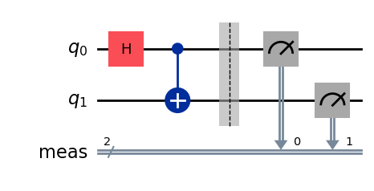
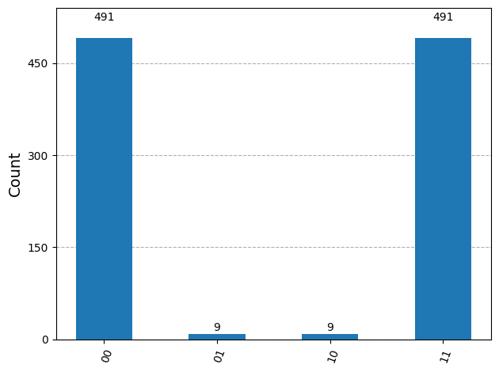

<iframe width="560" height="315" src="https://www.youtube.com/embed/vSFv_i_FAXg?list=PLOFEBzvs-VvoRwhofpHlBqMnR1ldAmKZJ&index=3" title="From Zero to Quantum" frameborder="0" allowfullscreen></iframe>

# Goal

This note starts using a quantum machine from the quantum-computing "hello world": create a small circuit, run it, and read the measured bitstrings.

The first circuit is a Bell-state circuit. It is small, but it already uses the two ideas that make quantum computation different from ordinary Boolean computation:

- **Superposition:** one qubit can represent a linear combination of basis states.
- **Entanglement:** two qubits can have correlated measurement outcomes that cannot be described as two independent local states.

# Environment Setup

```python
!pip install qiskit[visualization] qiskit-ibm-runtime qiskit-aer

from qiskit import QuantumCircuit
from qiskit.visualization import plot_histogram
from qiskit_aer import AerSimulator
from qiskit.transpiler.preset_passmanagers import generate_preset_pass_manager
from qiskit_ibm_runtime import SamplerV2 as Sampler, QiskitRuntimeService
```

Key pieces:

- `QuantumCircuit` defines the qubits, gates, and measurements.
- `plot_histogram` visualizes measurement counts.
- `AerSimulator` runs the circuit locally for quick debugging.
- `generate_preset_pass_manager` transpiles the abstract circuit into operations suitable for a target backend.
- `SamplerV2` executes circuits and returns sampled measurement outcomes.
- `QiskitRuntimeService` authenticates with IBM Quantum and provides access to real QPUs.

# Quantum Hello World: Bell Circuit

```python
from qiskit import QuantumCircuit

circuit = QuantumCircuit(2)
circuit.h(0)
circuit.cx(0, 1)
circuit.measure_all()
circuit.draw("mpl")
```



The circuit has three main steps:

1. Start from $\vert 00 \rangle$.
2. Apply a Hadamard gate to qubit 0, putting it into superposition.
3. Apply CNOT with qubit 0 as the control and qubit 1 as the target.

Mathematically:

$$
\vert 00 \rangle
\xrightarrow{H \text{ on qubit } 0}
\frac{\vert 00 \rangle + \vert 10 \rangle}{\sqrt{2}}
\xrightarrow{\mathrm{CNOT}}
\frac{\vert 00 \rangle + \vert 11 \rangle}{\sqrt{2}}.
$$

After measurement, the ideal result should be mostly `00` and `11`, each with probability close to one half. The outcomes `01` and `10` should be rare in an ideal simulator, and on real hardware they usually indicate noise or gate/readout error.

# Running a Circuit

```python
def run_circuit_and_get_counts(circuit, backend, shots=1000):
    pm = generate_preset_pass_manager(backend=backend, optimization_level=1)
    isa_circuit = pm.run(circuit)

    sampler = Sampler(mode=backend)
    job = sampler.run([isa_circuit], shots=shots)
    result = job.result()

    return result[0].data.meas.get_counts()
```

The workflow is:

1. **Transpile:** adapt the circuit to the target backend.
2. **Sample:** run the circuit many times because quantum measurement is probabilistic.
3. **Count:** summarize how often each bitstring appears.

The parameter `shots` controls how many repeated measurements are collected. More shots give a more stable estimate of the output distribution.

# Running on IBM Quantum Hardware

```python
QiskitRuntimeService.save_account(
    channel="ibm_quantum_platform",
    token="YOUR_API_TOKEN",
    overwrite=True,
    set_as_default=True,
)

service = QiskitRuntimeService(channel="ibm_quantum_platform")
backend = service.least_busy(operational=True, simulator=False, min_num_qubits=127)
print(backend.name)
```

A real backend is a physical quantum processing unit. The circuit must be transpiled because each device has its own native gates, qubit connectivity, calibration state, and queue.



In this first run, the expected Bell outcomes `00` and `11` dominate. The small counts for `01` and `10` are the practical part of using real hardware: physical devices have gate noise, readout error, and calibration drift, so the measured distribution is close to the ideal result but not perfectly clean.

Never commit a real API token into code. Save it locally or pass it through a secure environment variable.

# Running on a Simulator

```python
backend = AerSimulator()
```

The simulator is the right first backend for learning and debugging:

- It avoids cloud queues and hardware allocation limits.
- It gives a clean baseline for the circuit's expected behavior.
- It can optionally include controlled noise models.

The limitation is scale. A classical simulator must represent a state vector whose size grows like $2^N$ for $N$ qubits, so large circuits become expensive quickly. A simulator is useful for development, but it is not a substitute for a physical QPU when the goal is to study real-device behavior or quantum-scale computation.

# Takeaways

- A practical Qiskit workflow is: **build circuit -> choose backend -> transpile -> sample -> inspect counts**.
- The Bell circuit is a useful hello world because it combines superposition and entanglement in only two qubits.
- Simulators are best for fast iteration; IBM Quantum hardware is needed to see how the circuit behaves on an actual quantum machine.
