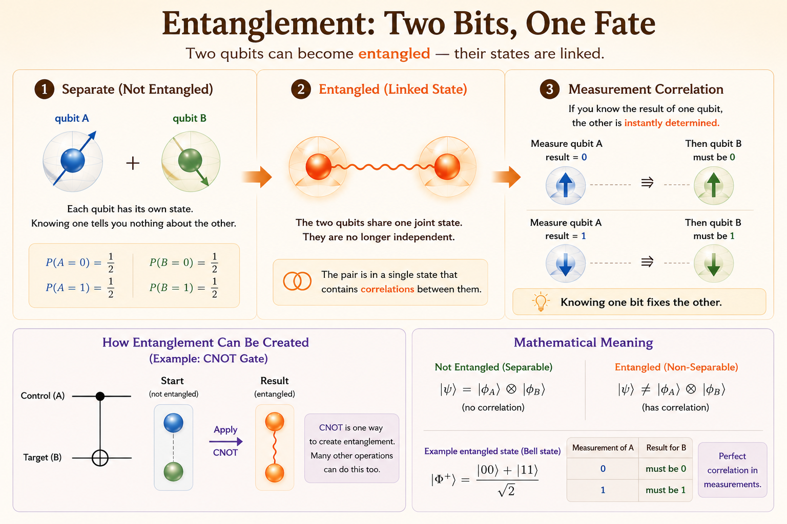

<iframe width="560" height="315" src="https://www.youtube.com/embed/lKFElrwEZrU" title="The Math Behind Quantum Entanglement" frameborder="0" allowfullscreen></iframe>

# Main Idea

Entanglement is often described in physical language, but this note focuses on the mathematical meaning.

Mathematically, entanglement means the joint state of multiple qubits cannot be written as a simple product of independent single-qubit states. The two qubits must be described together as one shared state vector.

# Qubit Collapse and Measurement

- The phrase "a qubit can exist in two positions at the same time" is misleading.
- In physics, there is no way to deterministically predict the measured position of a qubit.
  - We can calculate the probability of a qubit being measured in each position.
  - We can measure the qubit and get one position: the random position observed at measurement time.

Mathematically, a qubit state assigns amplitudes to possible measurement outcomes. Before measurement, we use the amplitudes to calculate probabilities. After measurement, we observe one outcome.

For a one-qubit state

$$
\lvert \psi \rangle = \alpha \lvert 0 \rangle + \beta \lvert 1 \rangle,
$$

the probabilities are

$$
P(0) = |\alpha|^2,
\qquad
P(1) = |\beta|^2,
\qquad
|\alpha|^2 + |\beta|^2 = 1.
$$

So quantum mechanics predicts the probability distribution of measurement results, not a deterministic outcome before measurement.

# Bell State

A Bell state is a maximally entangled two-qubit state. The standard example is

$$
\lvert \Phi^+ \rangle =
\frac{1}{\sqrt{2}}(\lvert 00 \rangle + \lvert 11 \rangle).
$$

This state says there are only two possible outcomes:

- $\lvert 00 \rangle$ with probability $\frac{1}{2}$
- $\lvert 11 \rangle$ with probability $\frac{1}{2}$

The outcomes $\lvert 01 \rangle$ and $\lvert 10 \rangle$ have probability zero.

In vector form, using the basis order

$$
\lvert 00 \rangle,\ \lvert 01 \rangle,\ \lvert 10 \rangle,\ \lvert 11 \rangle,
$$

the Bell state is

$$
\lvert \Phi^+ \rangle =
\frac{1}{\sqrt{2}}
\begin{bmatrix}
1 \\
0 \\
0 \\
1
\end{bmatrix}.
$$

# What Entanglement Means Mathematically

The key question is whether the two-qubit Bell state can be separated into two one-qubit states.

Assume it could be written as

$$
(\alpha \lvert 0 \rangle + \beta \lvert 1 \rangle)
\otimes
(\gamma \lvert 0 \rangle + \delta \lvert 1 \rangle).
$$

Expanding the tensor product gives

$$
\alpha\gamma \lvert 00 \rangle
+ \alpha\delta \lvert 01 \rangle
+ \beta\gamma \lvert 10 \rangle
+ \beta\delta \lvert 11 \rangle.
$$

To match the Bell state, the coefficients would need to satisfy

$$
\alpha\gamma = \frac{1}{\sqrt{2}},
\qquad
\alpha\delta = 0,
\qquad
\beta\gamma = 0,
\qquad
\beta\delta = \frac{1}{\sqrt{2}}.
$$

This is impossible. The first equation requires both $\alpha$ and $\gamma$ to be nonzero. The last equation requires both $\beta$ and $\delta$ to be nonzero. But then $\alpha\delta$ and $\beta\gamma$ cannot both be zero.

That is the mathematical meaning of entanglement: the combined state cannot be factored into independent local states.

# Gates

A quantum gate is a matrix that transforms one state vector into another state vector.

This section explains entanglement from the mathematical side: how gate operations change quantum state vectors and create correlated measurement outcomes. It is not a physics explanation of what physically causes entanglement.

# Single-Qubit Gate: Hadamard

The Hadamard gate is

$$
H =
\frac{1}{\sqrt{2}}
\begin{bmatrix}
1 & 1 \\
1 & -1
\end{bmatrix}.
$$

Applied to $\lvert 0 \rangle$, it creates an equal superposition:

$$
H \lvert 0 \rangle =
\frac{1}{\sqrt{2}}
\begin{bmatrix}
1 & 1 \\
1 & -1
\end{bmatrix}
\begin{bmatrix}
1 \\
0
\end{bmatrix}
=
\frac{1}{\sqrt{2}}
\begin{bmatrix}
1 \\
1
\end{bmatrix}
=
\frac{1}{\sqrt{2}}(\lvert 0 \rangle + \lvert 1 \rangle).
$$

Applied to $\lvert 1 \rangle$, it creates

$$
H \lvert 1 \rangle =
\frac{1}{\sqrt{2}}
\begin{bmatrix}
1 & 1 \\
1 & -1
\end{bmatrix}
\begin{bmatrix}
0 \\
1
\end{bmatrix}
=
\frac{1}{\sqrt{2}}
\begin{bmatrix}
1 \\
-1
\end{bmatrix}
=
\frac{1}{\sqrt{2}}(\lvert 0 \rangle - \lvert 1 \rangle).
$$

# Two-Qubit Gate: CNOT

The CNOT gate flips the target qubit if the control qubit is 1.

Using the basis order

$$
\lvert 00 \rangle,\ \lvert 01 \rangle,\ \lvert 10 \rangle,\ \lvert 11 \rangle,
$$

its matrix is

$$
\operatorname{CNOT} =
\begin{bmatrix}
1 & 0 & 0 & 0 \\
0 & 1 & 0 & 0 \\
0 & 0 & 0 & 1 \\
0 & 0 & 1 & 0
\end{bmatrix}.
$$

The action on basis states is:

| Input | Output | Meaning |
|---|---|---|
| $\lvert 00 \rangle$ | $\lvert 00 \rangle$ | Control is 0, target unchanged |
| $\lvert 01 \rangle$ | $\lvert 01 \rangle$ | Control is 0, target unchanged |
| $\lvert 10 \rangle$ | $\lvert 11 \rangle$ | Control is 1, target flips from 0 to 1 |
| $\lvert 11 \rangle$ | $\lvert 10 \rangle$ | Control is 1, target flips from 1 to 0 |

## Basis-State Calculations

For $\lvert 00 \rangle$:

$$
\operatorname{CNOT}\lvert 00 \rangle =
\begin{bmatrix}
1 & 0 & 0 & 0 \\
0 & 1 & 0 & 0 \\
0 & 0 & 0 & 1 \\
0 & 0 & 1 & 0
\end{bmatrix}
\begin{bmatrix}
1 \\
0 \\
0 \\
0
\end{bmatrix}
=
\begin{bmatrix}
1 \\
0 \\
0 \\
0
\end{bmatrix}
= \lvert 00 \rangle.
$$

For $\lvert 01 \rangle$:

$$
\operatorname{CNOT}\lvert 01 \rangle =
\begin{bmatrix}
1 & 0 & 0 & 0 \\
0 & 1 & 0 & 0 \\
0 & 0 & 0 & 1 \\
0 & 0 & 1 & 0
\end{bmatrix}
\begin{bmatrix}
0 \\
1 \\
0 \\
0
\end{bmatrix}
=
\begin{bmatrix}
0 \\
1 \\
0 \\
0
\end{bmatrix}
= \lvert 01 \rangle.
$$

For $\lvert 10 \rangle$:

$$
\operatorname{CNOT}\lvert 10 \rangle =
\begin{bmatrix}
1 & 0 & 0 & 0 \\
0 & 1 & 0 & 0 \\
0 & 0 & 0 & 1 \\
0 & 0 & 1 & 0
\end{bmatrix}
\begin{bmatrix}
0 \\
0 \\
1 \\
0
\end{bmatrix}
=
\begin{bmatrix}
0 \\
0 \\
0 \\
1
\end{bmatrix}
= \lvert 11 \rangle.
$$

For $\lvert 11 \rangle$:

$$
\operatorname{CNOT}\lvert 11 \rangle =
\begin{bmatrix}
1 & 0 & 0 & 0 \\
0 & 1 & 0 & 0 \\
0 & 0 & 0 & 1 \\
0 & 0 & 1 & 0
\end{bmatrix}
\begin{bmatrix}
0 \\
0 \\
0 \\
1
\end{bmatrix}
=
\begin{bmatrix}
0 \\
0 \\
1 \\
0
\end{bmatrix}
= \lvert 10 \rangle.
$$

# Creating a Bell State

Start with two qubits in $\lvert 00 \rangle$.

Apply a Hadamard gate to the first qubit:

$$
\lvert 00 \rangle
\xrightarrow{H \otimes I}
\frac{1}{\sqrt{2}}(\lvert 00 \rangle + \lvert 10 \rangle).
$$

Then apply CNOT with the first qubit as control:

$$
\frac{1}{\sqrt{2}}(\lvert 00 \rangle + \lvert 10 \rangle)
\xrightarrow{\operatorname{CNOT}}
\frac{1}{\sqrt{2}}(\lvert 00 \rangle + \lvert 11 \rangle).
$$

The Hadamard gate creates superposition. The CNOT gate spreads that superposition across two qubits, producing a joint state where the two measurement outcomes are perfectly correlated.

# Takeaways

- A qubit state stores amplitudes; squared amplitudes give measurement probabilities.
- A Bell state is a joint two-qubit state with perfectly correlated outcomes.
- The mathematical signature of entanglement is non-separability: the joint state cannot be factored into independent single-qubit states.
- Gates are matrices, and entanglement can be studied by tracking how those matrices transform state vectors.
