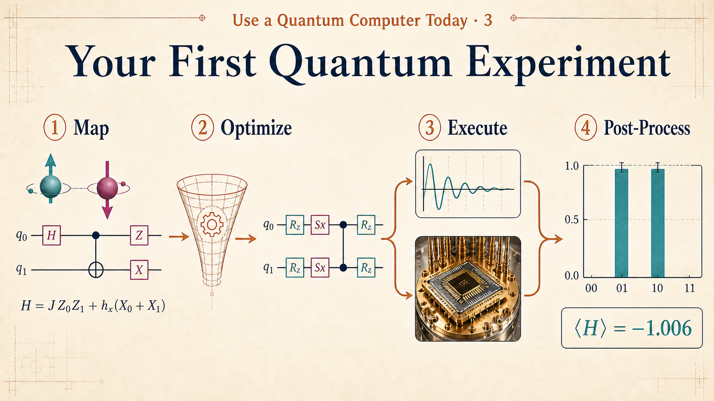
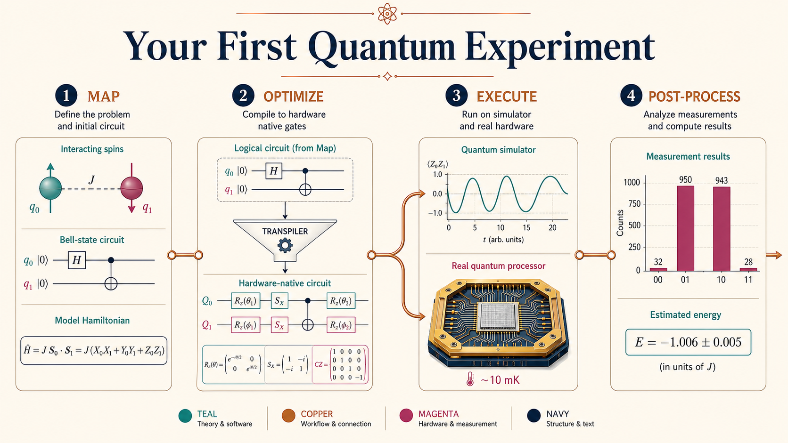
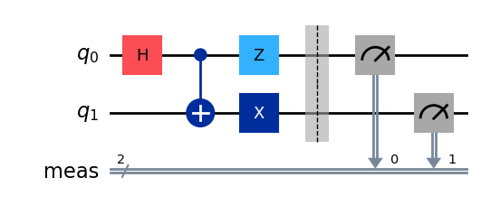
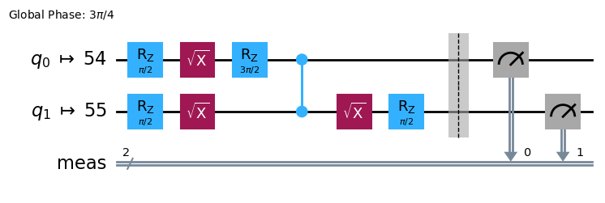
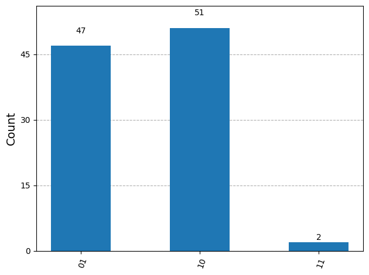

<iframe width="560" height="315" src="https://www.youtube.com/embed/kniiVC538nY?list=PLOFEBzvs-VvoRwhofpHlBqMnR1ldAmKZJ&index=1" title="Your First Quantum Experiment" frameborder="0" allowfullscreen></iframe>

Small quantum systems can be simulated classically, but the state space doubles with every added qubit, so exact simulation quickly becomes impractical. Quantum computers evolve the state directly, making tasks such as sampling correlated outcomes and estimating a system's energy natural quantum workloads.

# Experiment

The goal is to simulate a simple model of quantum physics on a real quantum computer using the Qiskit Patterns framework.

- **Interacting quantum spins:** Two spins have an antiferromagnetic interaction, so they prefer opposite orientations.
- **Transverse magnetic field:** An external field can flip the spins and drive them into superposition.
- **State distribution:** The `Sampler` primitive measures the probabilities of the prepared Bell-state outcomes.
- **System energy:** The `Estimator` primitive calculates the expectation value of the Hamiltonian.

# Qiskit Framework Pattern

A Qiskit experiment follows four steps:

1. **Map:** Translate the physical problem into a circuit and observables.
2. **Optimize:** Adapt the circuit and observables to the target hardware.
3. **Execute:** Run on a simulator or quantum processing unit.
4. **Post-process:** Convert the returned data into probabilities or expectation values.



# Experiment 1: Use `Sampler` to Measure the State

## Map

Prepare the entangled Bell state

$$
\lvert \Psi^- \rangle
=
\frac{1}{\sqrt{2}}
(\lvert 01 \rangle - \lvert 10 \rangle).
$$

The state in the original note,

$$
\frac{1}{\sqrt{2}}
(\lvert 10 \rangle - \lvert 01 \rangle),
$$

differs only by a global phase of $-1$, so it represents the same physical state.

```python
from qiskit import QuantumCircuit

qc = QuantumCircuit(2)
qc.h(0)
qc.cx(0, 1)
qc.x(1)
qc.z(0)
qc.measure_all()

qc.draw("mpl")
```



### Gate-by-Gate State Evolution

The two qubits start in $\lvert 00 \rangle$.

**1. Hadamard on qubit 0**

The Hadamard gate puts $q_0$ into equal superposition:

$$
\frac{\lvert 0 \rangle + \lvert 1 \rangle}{\sqrt{2}}
\otimes \lvert 0 \rangle
=
\frac{\lvert 00 \rangle + \lvert 10 \rangle}{\sqrt{2}}.
$$

**2. CNOT from qubit 0 to qubit 1**

CNOT correlates the two qubits and creates $\lvert \Phi^+ \rangle$:

$$
\frac{\lvert 00 \rangle + \lvert 11 \rangle}{\sqrt{2}}.
$$

**3. Pauli-X on qubit 1**

The X gate flips $q_1$:

$$
\frac{\lvert 01 \rangle + \lvert 10 \rangle}{\sqrt{2}}
= \lvert \Psi^+ \rangle.
$$

**4. Pauli-Z on qubit 0**

The Z gate changes the phase of the component whose first qubit is $1$:

$$
\frac{\lvert 01 \rangle - \lvert 10 \rangle}{\sqrt{2}}
= \lvert \Psi^- \rangle.
$$

## Optimize

Optimization adapts the abstract circuit to a particular backend:

1. Select a real quantum computer or simulator.
2. Map logical qubits to physical qubits.
3. Rewrite the circuit using the backend's native gates and connectivity.
4. Optionally configure error-suppression and mitigation techniques.

```python
from qiskit_ibm_runtime import QiskitRuntimeService
from qiskit.transpiler.preset_passmanagers import generate_preset_pass_manager

service = QiskitRuntimeService()
backend = service.least_busy(
    operational=True,
    simulator=False,
    min_num_qubits=127,
)

pm = generate_preset_pass_manager(
    target=backend.target,
    optimization_level=3,
)
qc_isa = pm.run(qc)
qc_isa.draw("mpl")
```



In this transpiled circuit:

- Logical qubits are mapped to physical qubits 54 and 55.
- `Rz` and $\sqrt{X}$ are native single-qubit operations.
- The connected filled dots represent a CZ entangling gate.
- The global phase $3\pi/4$ does not affect measurement probabilities.

## Execute

`SamplerV2` runs the transpiled circuit repeatedly. Each repetition, or shot, produces one measured bitstring.

```python
from qiskit_ibm_runtime import SamplerV2 as Sampler

sampler = Sampler(mode=backend)
job = sampler.run([qc_isa], shots=100)
result = job.result()
counts = result[0].data.meas.get_counts()
```

A simulator can be used first for debugging, while real hardware reveals gate noise, readout error, and calibration effects.

## Post-Process

```python
from qiskit.visualization import plot_histogram

print("counts =", counts)
plot_histogram(counts)
```



The results are dominated by `01` and `10`, which is the expected signature of $\lvert \Psi^- \rangle$: when one qubit is measured as 0, the other is measured as 1. The small `11` count comes from real-device noise.

# Experiment 2: Use `Estimator` to Measure Energy

## Map

The Hamiltonian defines the total energy of the two-spin system:

$$
H = J Z_0 Z_1 + h_x(X_0 + X_1).
$$

| Term | Meaning |
|---|---|
| $H$ | Total energy operator of the system |
| $JZ_0Z_1$ | Interaction between the two spins; $J>0$ favors opposite orientations for this convention |
| $h_x(X_0+X_1)$ | Transverse field that flips spins and introduces superposition |

Represent the Hamiltonian as a sparse sum of Pauli operators:

```python
from qiskit.quantum_info import SparsePauliOp

J = 1.0      # Antiferromagnetic coupling for H = J Z0 Z1
hx = -0.5    # Transverse-field strength

observable = SparsePauliOp.from_list([
    ("ZZ", J),
    ("XI", hx),
    ("IX", hx),
])

qc = QuantumCircuit(2)
qc.h(0)
qc.cx(0, 1)
qc.x(1)
qc.z(0)
```

The energy of a prepared state $\lvert \psi \rangle$ is the expectation value

$$
E = \langle \psi \rvert H \lvert \psi \rangle.
$$

## Optimize

The circuit and observable must use the same physical-qubit layout:

```python
pm = generate_preset_pass_manager(
    target=backend.target,
    optimization_level=3,
)

qc_isa = pm.run(qc)
observable_isa = observable.apply_layout(layout=qc_isa.layout)
```

## Execute

```python
from qiskit_ibm_runtime import EstimatorV2 as Estimator

estimator = Estimator(mode=backend)
pubs = [(qc_isa, observable_isa)]
job = estimator.run(pubs)
result = job.result()
```

Unlike `Sampler`, which returns a distribution of bitstrings, `Estimator` returns expectation values of observables.

## Post-Process

```python
energy = result[0].data.evs
print(energy)
```

Example output:

```text
-1.0063263799978701
```

The measured value is an estimate affected by finite sampling and hardware noise. Energy estimation becomes especially important in variational quantum algorithms, where a parameterized circuit is adjusted to search for a low-energy state.

# Extensions

- **Ground state:** The ground state is the state with the lowest eigenvalue of the Hamiltonian.
- **Variational principle:** For an exact normalized trial state, the expected energy cannot be below the true ground-state energy.
- **Optimization:** Adjusting circuit parameters to lower the estimated energy is the core idea behind variational quantum eigensolvers.
- **Practical caution:** On noisy hardware, a lower measured value is not automatically more accurate; sampling and device errors must also be considered.

# Takeaways

- The same four-step pattern organizes both sampling and energy-estimation experiments.
- `Sampler` estimates a probability distribution over measurement outcomes.
- `Estimator` evaluates the expectation value of an observable such as a Hamiltonian.
- Classical simulation is valuable for small systems, but its memory and computation costs grow exponentially with the number of qubits.
